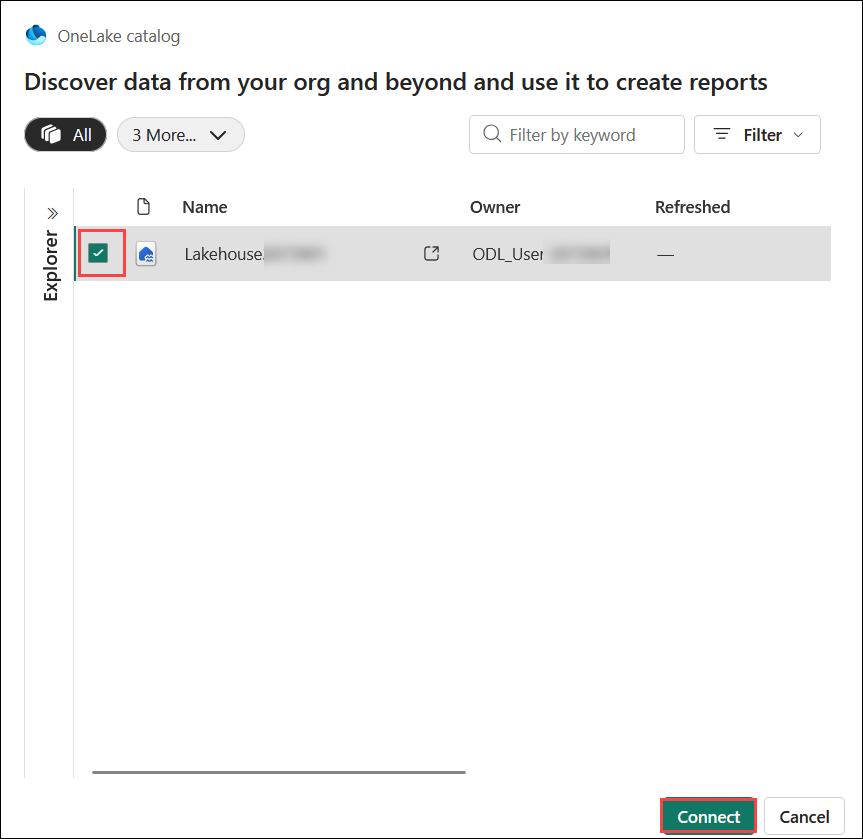

## Usecase 01-Build a Real-Time Parcel Delivery Monitoring Solution with Microsoft Fabric

**Scenario: The Fabrikam Frenzy – Real-Time Intelligence Under
Pressure**

Fabrikam, a global lifestyle brand known for its high-quality outerwear
and athleisure, operates a thriving retail and e-commerce business. As
the monsoon season intensifies, an unexpected wave of publicity hits:
several celebrity athletes post viral videos wearing Fabrikam’s latest
apparel. Within minutes, online clickstream traffic surges, add-to-cart
rates spike, and store associates struggle to understand what inventory
is actually available in real time.

At the same moment, a series of operational disruptions emerge across
Fabrikam’s supply chain:

- A tropical depression abruptly changes course, disrupting major
  transit routes and triggering carrier ETA delays.

- A key fabric supplier reports a loom vibration anomaly, with rising
  defect probabilities detected in quality telemetry.

- Several defective apparel units slip through and get shipped to
  customers, causing a rise in returns and service complaints.

- Headquarters receives reports from operations teams that visibility
  into real-time conditions is nearly nonexistent.

- Leadership grows increasingly frustrated that operational issues are
  being solved reactively instead of proactively.

With demand surging and disruptions unfolding minute-by-minute, Fabrikam
faces the risk of stockouts, delayed deliveries, customer
dissatisfaction, and reputational damage. The company urgently needs
**real-time intelligence** to sense demand as it happens, maintain
product availability, and fulfill customer promises despite rapidly
shifting conditions.

**Objective:**
•	Ingest and unify real-time data streams from manufacturing, logistics, e-commerce clickstream, weather, and product systems.
•	Detect operational disruptions such as shipment delays, manufacturing defects, and supply chain risks as they occur.
•	Provide real-time visibility through dashboards that enable proactive decision-making.
•	Monitor customer demand signals to prevent stockouts and improve fulfillment accuracy.
•	Automate alerts and actions using Microsoft Fabric Activator to reduce reaction time to critical events.


# Exercise 1: Environment Setup

## Task 1: Configure Azure Storage Account with Product data

1.  In the Azure portal, search box, type **Storage accounts** and then click on the **Storage accounts**.

    

1.  On the **Storage account** page, click **+Create**.

1.  On **Create a storage account** page, under the **Basics** tab, enter the following details to create a storage account and then click on **Next**

    |  |   |
    |----|----|
    |Subscription|	Select your Azure OpenAI subscription|
    |Resource group|	Select **FabricRG** |
    |Storage account name	|**storage<inject key="DeploymentID" enableCopy="false" />**|
    |Region	|**<inject key="Region" enableCopy="false" />**|
    |Performance	|Standard: Recommended for most scenarios (general-purpose v2 account)|
    |Redundancy	|Locally-redundant storage (LRS)|


     

1.  Under the **Advanced** tab, select **"Enable hierarchical namespace"** and click on **Review+create.**

     

1.  On the **Review + Create** page, click **Create**.

     

1. The Azure Storage account is now set up to host data for Azure Data Lake. Click **Go to resource**.

     

1. On the left-side navigation pane of your Storage Account, select **Data storage** section and then select **Containers**.

     

1. Click **Add Container.**

    

1.  On the New container pane that appears on the right side, enter the container Name as **shipping-events** and click on **Create** button.

    

1. Go back to your Storage Account. From the left navigation, select **Access keys** under **Security + networking** group,copy **Connection string** and **Storage account name**, paste them
    in a notepad, and then **Save** the notepad to use the information in the upcoming task.

    

## Task 2: Create a single database - Azure SQL Database

1.  From the Azure portal home page, click on **Azure portal menu** represented by three horizontal bars on the left side of the Microsoft Azure command bar. Select  **Azure SQL database**

    

1.  Click on **+ Create** and select **SQL Database**

   

1.  In this pane, under the **Basics** tab, enter the below details to create an Azure SQL Database and then click
    on **Next: Networking**

    | Setting                | Value / Action |
    |------------------------|----------------|
    | Subscription           | Leave the subscription group as default |
    | Resource group         | Select **FabricRG** |
  
     
  
    | Setting                | Value / Action |
    |------------------------|----------------|
    | Server                  | Select **Create new** |
    | Server name             | **sqlserver<inject key="DeploymentID" enableCopy="false" />**|
    | Location                | **<inject key="Region" enableCopy="false" />** |
    | Authentication Method   | Use SQL authentication |
    | Server admin login      | sqladmin |
    | Password                | password321!|
    | Confirm password        | password321!|
    | Action                  | Click **OK** |
  
     
  
     

1.  On the **Networking** tab, select **Public endpoint**, set **Allow Azure services and resources** to **Yes**, enable **Add current client IP address**, and then click **Review + create**.
   
     

1.  On the **Review + create** page, after reviewing, select **Create**

     

1.  On **Microsoft.SQLDatabase** window, after the deployment is completed, click on the **Go to resource** button

1.  In SQL database page select **Query editor**.

     

1.  In the **Query editor (preview)**, enter the SQL server **login** as **sqladmin** and **password** as **password321!**, then click **OK** to connect to the database.

    

1. To create the **Product** table, paste the following code into the **Query editor** and run it to create the stored procedure.
    ```
    -- Step 1: Create the Products table
    CREATE TABLE Products (
        ProductId VARCHAR(20) PRIMARY KEY,
        ProductName VARCHAR(100),
        SKU VARCHAR(20),
        Brand VARCHAR(50),
        Category VARCHAR(50),
        UnitCost DECIMAL(10, 2)
    );
    ```

    

1. To enable database for **CDC,** click on **+New Query** and  paste the following code into the **Query editor** and run it to create the stored procedure.

    ```
    -- Enable Database for CDC
    EXEC sys.sp_cdc_enable_db;
    ```

     

1. To enable CDC for a table using a gating role option, click on +New Query and paste the following code into the **Query editor** and run it to create the
    stored procedure.
    
      ```
      -- Enable CDC for a table using a gating role option
      EXEC sys.sp_cdc_enable_table
          @source_schema = N'dbo',
          @source_name   = N'Products',
          @role_name     = NULL
      GO
      ```

      

1. Go back to your SQL Database. Copy **Server name** and **SQL Database name**, paste them in a notepad, and then **Save** the
    notepad to use the information in the upcoming task.

      

## Task 3: Create a Fabric workspace

In this task, you create a Fabric workspace. The workspace contains all the items needed for this lakehouse tutorial, which includes lakehouse,dataflows, Data Factory pipelines, the notebooks, Power BI datasets, and
reports.

1.  Open your browser, navigate to the address bar, and type or paste the following URL:**https://app.fabric.microsoft.com/** press the **Enter** button and sign in with your credentials and click on **Submit**

    |   |    |
    |-----|----|
    |Username| <inject key="AzureAdUserEmail"></inject>|
    |Password	|<inject key="AzureAdUserPassword"></inject>|

    

2.  In the Workspaces pane, click on **+New workspace** tile

    

3.  In the **Create a workspace** pane that appears on the right side,enter the following details, and click on the **Apply** button.

    |  |    |
    |-----|-----|
    |Name	|**RealTimeWorkspace<inject key="DeploymentID" enableCopy="false" />** |
    |Advanced	|Under Workspace Type, select **Fabric**|
    |Default|	storage format Small dataset storage format|


## Task 4: Create a lakehouse

1.  In the Workspaces pane, select **+ New item**.


1.  In the **Filter by item type** search box,enter **Lakehouse** and select the lakehouse item.

    

1.  Enter +++**Lakehouse<inject key="DeploymentID" enableCopy="false" />** as the lakehouse name and unselect the lakehouses schemas. Select **Create**.

    

1.  When provisioning is complete, the lakehouse explorer page is shown.

    

## Task 5: Create an Eventhouse

1.  From the left-sided navigation menu select the workspace to return to the workspace item list.

    

2.  In the Workspaces pane, select **+ New item**.

    

3.  In the **Filter by item type** search box, enter **Eventhouse** and select the Eventhouse item.

    

4.  Enter **Eventhouse<inject key="DeploymentID" enableCopy="false" />** as the eventhouse name. A KQL database is created simultaneously with the same name and select **Create**. 

    

5.  When provisioning is complete, the eventhouse **System overview** page is shown.

    

# Exercise 2: Ingest Manufacturing data into Eventhouse using Eventstream

## Task 1: Set Up an Eventstream and Create Custom Endpoints

In this task, you will create an Event Stream and add the Manufacturing
data as the source.

1.  From the left navigation pane in the eventhouse, select
    the **RealTimeWorkspace<inject key="DeploymentID" enableCopy="false" />** .

    

1.  In the Workspaces pane, select **+ New item**. In the **Filter by
    item type** search box, enter **Eventstream** and select the
    **Eventstream** item

    

1.  Enter **Eventstream<inject key="DeploymentID" enableCopy="false" />** as the eventstream name and select **Create**. 

   

1.  On the Screen **Design a flow to ingest, transform, and route streaming events** click on **Use custom Endpoint**. This will
    create an event hub connected to the Eventstream.

    

1.  Insert **CustomEndpoint-L400** as the source name and the  click on **Add**.

    

1.  Click on the **Publish** button.

    

1.  On the **Eventstream** pane, select the **keys** under the **Details**, select **SAS key Authentication ,** copy the **Event hub name**, **connection strings-primarykey** and paste them on a notepad, as you need them in the upcoming task

    

8.  Now, click on **RealTimeWorkspace<inject key="DeploymentID" enableCopy="false" />** on the left-sided navigation
    pane.

    

## Task 2: Import Manufacturing data Notebook

1.  On the **RealTimeWorkspace** page, from the menu bar, navigate and click on **-\>|Import** button, then select **Notebook** and
    select **From this computer** as shown in the below image.
    
     

3.  Select **Upload** from the **Import status** pane that appears on the right side of the screen.

     

3.  Navigate and select **Manufacturing Simulator** notebooks from **C:\LabFiles**and click on the **Open** button.

     

4.  You will see a notification stating **Imported successfully.**

5.  Then, select the **Manufacturing Simulator**  notebook.

     

6.  In the **Explorer** pane, click **Add data items**, and then select **From OneLake Catalog** to connect to an existing data source.

     

7.  In the **OneLake catalog**, select **Lakehouse<inject key="DeploymentID" enableCopy="false" />** and click
    **Connect** to link it as a data source.

     

8.  To start the notebook, run the **0th** cell.

     

9.  In the **first** cell paste the **connection string of your custom app source and EventHubName** (the value that you have saved in your notepad in the (Exercise 2\>**Task 1\>Step 7)**, select the **Run** icon that appears on the left side of the cell

     

     

10. Select the **second** cell to **generate the site location**, and then **run** the cell.

    

11. Select the third cell to generate the assets, and then run the cell.

    

12. Select the fourth cell to generate the Operators, and then run the
    cell.

    

13. Select the fifth cell to generate the products, and then run the
    cell.

    

14. Select the sixth cell to generate the event functions, and then run
    the cell.

    

15. Select the seventh cell and then run the cell.

   

16. Select the eighth cell to Streaming simulations, and then run
    the cell.

   

17. Select the ninth cell and then run the cell.

   

**Note**: Skip running the tenth cell, which is the final cell in the
notebook.

18. Now, click on **Eventstream<inject key="DeploymentID" enableCopy="false" />** on the left navigation pane.

    

19. In the event stream authoring canvas, select the **Edit**

    

20. Click on the node **Transform events or add Destination** and
    select **SQL Code** from the menu.

    

21. Select **SqlCode** node and click on **Action**

    

22. Click on **Edit query**

    

23. Use the following SQL transformation on the DefectProbability column
    to mark values greater than 0.1 as *Anomaly*. Copy the code and
    select **Test query**.

    ```
    SELECT * ,CASE WHEN DefectProbability>0.1 THEN'1' ELSE '0' END AS Anamoly FROM [Eventstream<inject key="DeploymentID" enableCopy="false" />-stream]
    ```
   

   

24. Click **Save** to apply the changes.

   

25. Click **Save** to apply the changes.

   

26. To add a destination, open the **Add destination** dropdown and
    select **Eventhouse** from the context menu.

   

27. Provide the following values in the pane **Eventhouse**. Click the
    button **Save** after you entered all the values.

| Field                          | Value |
|--------------------------------|-------|
| Event processing before ingestion | Ensure that this option is selected. |
| Destination name | Eventhouse |
| Workspace                      | Select **RealTimeWorkspace<inject key="DeploymentID" enableCopy="false" />**. |
| Eventhouse                     | Select the Eventhouse **Eventhouse<inject key="DeploymentID" enableCopy="false" />** |
| KQL Database                   | Select the KQL Database **Eventhouse<inject key="DeploymentID" enableCopy="false" />** |
| Destination table              | Click **Create new**, enter **manufacturing** as the table name, and click **Done** |
| Input data format              | Ensure that the **JSON** option is selected |

  

15. Connect the output of the node **SqlCode** to the input of the
    node **Eventhouse**.

    

28. Click on the button **Publish** that is located in the toolbar at
    the top of the screen.

     

     

29. Click on the icon **Manufacturing Simulator notebook** in the top
    toolbar

    

30. Right-click **Lakehouse<inject key="DeploymentID" enableCopy="false" />** and click **Set as default
    lakehouse** from the menu

    

31. Click the **Run all** button to execute all the cells

    

    

## Task 3: Creating delta tables in the lakehouse 

1.  Select on the icon **RealTimeWorkspaceXX** in the left toolbar and
    click on **L400_Lakehouse**

    

2.  To verify that the files have been successfully loaded, click the
    **Files** folder in the **Explorer** pane. You should see the files
    listed in the right-hand pane of the window.

    

3.  Next we have to create delta tables in our Lakehouse from the files
    we uploaded. To do this access the context menu by clicking on the
    three dots (**...**). Select **Load to tables** from the context
    menu.

    

4.  Retain all default values and click on the button **Load**.

    

    

5.  These steps executed for the **assets.csv** file must be executed for the **operators.csv, product.csv**, and **sites.csv** files in the same manner as mentioned in the above step.

6.  To verify the data in the Eventhouse, select the **Eventstream<inject key="DeploymentID" enableCopy="false" />** icon from the top toolbar.

    

8.  Select the **Eventhouse** and verify the data.

    

## Task 4: Accessing Eventhouse data from the lakehouse 

1.  Click on the icon **RealTimeWorkspace<inject key="DeploymentID" enableCopy="false" />** in the left toolbar.

    

2.  Select the **Eventhouse<inject key="DeploymentID" enableCopy="false" />**

    

3.  From the **KQL databases** section, select **Eventhouse**

    

5.  Click on the button **+New** in the menu bar at the top.Choose **OneLake shortcut** from the dropdown menu.

    

5.  Select **Microsoft OneLake**

    

6.  Select the **Lakehouse<inject key="DeploymentID" enableCopy="false" />** in the Window **Select a data source
    type** and click on the button **Next**.

    

7.  Expand the folder **Tables** under **Lakehouse<inject key="DeploymentID" enableCopy="false" />** in the window **New shortcut** and check all tables. Click on **Next**.

     

8.  Click on the button **Create**.

     

9.  Click the **Close** button

    

    

# Exercise 3: Ingest Product Data from SQL Database into Eventhouse

## Task 1: Connect a SQL Database to an Eventstream

1.  Click on the icon **Real-Time** in the left toolbar.

     

2.  Select **Data sources** from the left navigation pane, choose the **Database CDC** tab, and then click **Connect** on **Azure SQL DB (CDC)**.

     

3.  Click on **New connection**

     

4.  In Connection settings tab enter the below detail and click on
    Connect button

    | Field    | Value |
    |----------|-------|
    | Server   | SQL server URL saved in **Exercise 1 → Task 2 → Step 13** |
    | Database | Enter your SQL database |
    | Username | sqladmin |
    | Password | Password321! |
  
    

    

5.  Enter the **Eventstream** name as **sql_eventstream+++**.

    

6.  In the **Connect data source** tab, open the **Tables** dropdown and select **Enter table name**.

    

8.  Enter the table name as **dbo.Products**

    

8.  Click on **Connect** button

    

9.  Click on **Finish** button

    

10. Select **RealTimeWorkspace<inject key="DeploymentID" enableCopy="false" />** in the left-sided navigation menu and click on **sql_eventstream**

    

    

11. In the event stream authoring canvas, select the **Edit**

    

12. Click on the node **Transform events or add Destination** and
    select **Eventhouse** from the menu.

    

13. Provide the following values in the pane **Eventhouse**. Click the
    button **Save** after you entered all the values.

    | Field                          | Value |
    |--------------------------------|-------|
    | Event processing before ingestion | Ensure that this option is selected. |
    | Workspace                      | Select **RealTimeWorkspaceXXX**. If you attend the Precon at dataMinds Connectrope, select the workspace name that was provided to you. |
    | Eventhouse                     | Select the Eventhouse **L400_Eventhouse** |
    | KQL Database                   | Select the KQL Database **L400_Eventhouse** |
    | Destination table              | Click **Create new**, enter **+++products+++** as the table name, and click **Done** |
    | Input data format              | Ensure that the **JSON** option is selected |

    

14. From the menu ribbon, select **Publish**.

> 


> 

15. Return to the **SQL Database Query Editor**, select **+ New query**,
    paste the provided product data SQL script into the query editor,
    and then execute the query to insert the data.
```
-- Step 2: Insert the product data
INSERT INTO dbo.Products (ProductId, ProductName, SKU, Brand, Category, UnitCost) VALUES
('PROD4000', 'Cyberpunk Hat', 'SKU4000', 'AirRun', 'Altars', 133.79),
('PROD4001', 'CloudShell Jacket', 'SKU4001', 'AirRun', 'Kids', 272.67),
('PROD4002', 'Oldschool Cardigan', 'SKU4002', 'UrbanStep', 'GenZ Pros', 295.88),
('PROD4003', 'TropicFeel Tshirt', 'SKU4003', 'UrbanStep', 'Colours', 138.43),
('PROD4004', 'ClassicWear Hoodie', 'SKU4004', 'ClassicWear', 'Kids', 63.33),
('PROD4005', 'TropicFeel Tshirt', 'SKU4005', 'AirRun', 'GenZ Pros', 182.16),
('PROD4006', 'UrbanStep Shoes', 'SKU4006', 'ZAVA', 'Colours', 36.00),
('PROD4007', 'UrbanStep Shoes', 'SKU4007', 'UrbanStep', 'Altars', 35.92),
('PROD4008', 'UrbanStep Shoes', 'SKU4008', 'ZAVA', 'Altars', 39.18),
('PROD4009', 'Cyberpunk Hat', 'SKU4009', 'AirRun', 'Kids', 53.56),
('PROD4010', 'UrbanStep Shoes', 'SKU4010', 'AirRun', 'GenZ Pros', 193.42),
('PROD4011', 'CloudShell Jacket', 'SKU4011', 'ClassicWear', 'Colours', 281.71),
('PROD4012', 'Oldschool Cardigan', 'SKU4012', 'StreetFlex', 'Altars', 94.36),
('PROD4013', 'Oldschool Cardigan', 'SKU4013', 'StreetFlex', 'Kids', 108.52),
('PROD4014', 'Cyberpunk Hat', 'SKU4014', 'ZAVA', 'Kids', 193.91),
('PROD4015', 'UrbanStep Shoes', 'SKU4015', 'ZAVA', 'GenZ Pros', 170.53),
('PROD4016', 'UrbanStep Shoes', 'SKU4016', 'StreetFlex', 'Altars', 281.30),
('PROD4017', 'Cyberpunk Hat', 'SKU4017', 'AirRun', 'Colours', 99.79),
('PROD4018', 'CloudShell Jacket', 'SKU4018', 'ClassicWear', 'Colours', 191.26),
('PROD4019', 'ClassicWear Hoodie', 'SKU4019', 'ClassicWear', 'GenZ Pros', 206.99);
```


1.  Return to the **sql_eventstream**, click **Refresh**, and verify
    that the data has been updated successfully.


2.  Click on the icon **L400_Eventhouse** in the top toolbar.


# Exercise 4: Ingest Shipping Data from Azure Storage Container into Eventhouse

## Task 1: Create a Workspace Identity 

1.  Click on the icon **RealTimeWorkspaceXXX** in the left toolbar.


2.  From the menu ribbon, select **Workspace settings**.


3.  In the **Workspace identity** settings pane and select **+ Workspace
    identity**


## Task 2: Assign Storage Blob Data Contributor Role to Fabric Workspace

1.  Open your browser, navigate to the address bar, and type or paste
    the following URL:+++<https://portal.azure.com/+++>, then press
    the **Enter** button.

2.  Select ResourceGroup1.

3.  In the **Resource Group Overview**, select the storage account named
    **l400storageXXX**.
    

5.  From the left menu, click on the **Access control(IAM**). On the
    Access control(IAM) page, Click **+Add** and select **Add role
    assignments**.

> 

5.  Type the **+++Storage Blob Data Contributor+++** in the search box and
    select it. Click **Next**


6.  In the **Add role assignment** tab, select Assign access to User
    group or service principal. Under Members, click **+Select members**


7.  On the Select members tab , search your Fabric workspace and
    click **Select.**


8.  In the **Add role assignment** page, Click **Review + Assign**, you
    will get a notification once the role assignment is complete.


9.  You will see a notification – added as **Stronge Blob Data
    Contributor**  for Azure Pass-Sponsorship.

> 

## Task 3: Import Shipping Data Notebook

1.  Return to the Fabric workspace .

2.  On the **RealTimeWorkspace** page, from the menu bar, navigate and
    click on **-\>|Import** button, then select **Notebook** and
    select **From this computer** as shown in the below image.

> 

3.  Select **Upload** from the **Import status** pane that appears on
    the right side of the screen.


4.  Navigate and select **Shipping Simulator** notebooks
    from **C:\LabFiles**and click on the **Open** button.


5.  Then, select the **Shipping Simulator**  notebook.


6.  Select the cell ,paste the **BLOB_CONNECTION_STRING and
    CONTAINER_NAME** (the value that you have saved in your notepad in
    the Exercise 1\> **Task 1\>Step 13)**, select the **Run** icon that
    appears on the left side of the cell.


7.  The last code cell its still running continue the next steps.


8.  Now, click on **L400_Eventhouse** on the top navigation pane.


9.  Click on the button **Get data** in the menu bar at the top.
    Choose **Azure Storage** from the dropdown menu.


10. Select the **+ New table**


11. Enter the new table name as +++**shipping+++**


12. Configure the Azure Blob Storage source by selecting **Connect to a
    storage account**, choosing the appropriate **Subscription**, **Blob
    storage account**, and **Container (shipping-events)**, then create
    a **New connection** to complete the setup.


13. Click on **Save** button


14. Select **Next**


15. Click on **Finish** button


16. The **Get data** process will take approximately **10–13 minutes**
    to complete.

17. Click on **Close** button


# Exercise 5: Share Weather Data with Fabrikam Distributors and Configure Hourly Alerts for the US Region

## Task 1: Create derived stream

1.  Click on the icon **Real-Time** in the left toolbar.


2.  In the **Data sources** pane, search for **+++Real-time weather+++**, and
    then select **Connect** to start ingesting live weather data into
    the Eventstream.


3.  Select **United States (US)** as the location for ingesting
    real-time weather data, verify the **Eventstream name** as
    **+++weather_eventstream+++**, and then click **Next** to continue.

> 

4.  Click on **Connect** button

> 

5.  Click on **Finish** button


6.  Click on the node **Transform events or add Destination** and
    select **Activator** from the menu.


7.  Select the **RealTimeWorkspace400L** workspace, create a new
    **Activator** by entering +++**temperature+++** as the activator
    name, keep the input data format as **JSON**, and then click
    **Done** to save the configuration.

> 

8.  Click on **Save**


9.  Click on the button **Publish** that is located in the toolbar at
    the top of the screen.


10. Click on the icon **RealTimeWorkspaceXXX** in the left toolbar and
    select **temperature**


11. Under the **Events** tab, select **New rule** to create a new event
    rule.

12. Enter the valid email and click on Start button


Summary:
This use case focuses on helping Fabrikam, a global retail and e-commerce brand, overcome real-time operational challenges during periods of extreme demand and disruption. A sudden surge in customer traffic, combined with weather-related transit delays and manufacturing quality issues, exposes the lack of real-time visibility across Fabrikam’s supply chain and fulfillment operations.
Using Microsoft Fabric Real-Time Intelligence, the solution integrates high-velocity data from multiple sources—including manufacturing telemetry, shipment events, e-commerce clickstream, weather data, and product information—into a single operational view. Eventstream, Eventhouse, KQL analytics, real-time dashboards, and Activator alerts work together to detect risks early, visualize live conditions, and trigger automated responses.
The outcome is a proactive, real-time operational command center that enables Fabrikam to protect customer experience, reduce delays, prevent defective shipments, and maintain business continuity under rapidly changing conditions


