# Lab 2: Build real-time operational dashboards with Real-Time Intelligence in Microsoft Fabric 

**Introduction**

In this lab, you will learn how to build a **real-time operational
dashboard** using **Microsoft Fabric Real-Time Intelligence (RTI)**.
Real-time dashboards enable organizations to visualize streaming data,
monitor key metrics, and respond instantly to anomalies or operational
changes. By leveraging Fabric RTI components such as **Eventstream**,
**Real-Time Hub**, and **KQL queries**, you will create interactive
dashboards that provide actionable insights for manufacturing,
logistics, or any time-sensitive business process.

------------------------------------------------------------------------

**Objectives**

- **Connect Real-Time Data Sources**  
  Integrate streaming data from sensors, IoT devices, or operational
  systems into Fabric RTI using Eventstream.

- **Design and Configure Dashboards**  
  Build dynamic dashboards in Power BI or Fabric that display live
  metrics, alerts, and KPIs with minimal latency.

- **Implement Real-Time Analytics**  
  Use KQL queries and transformations to process incoming data streams
  and derive meaningful insights.

- **Enable Alerts and Monitoring**  
  Configure real-time alerts for anomalies or threshold breaches to
  support proactive decision-making.

- **Validate Dashboard Performance**  
  Test the dashboard under simulated real-time conditions to ensure
  responsiveness and accuracy.

## Task 1: Get Latest Shipping details

1.  From the **RealTimeWorkspace<inject key="DeploymentID" enableCopy="false" />** view, select the **Eventhouse<inject key="DeploymentID" enableCopy="false" />** KQL Database.

    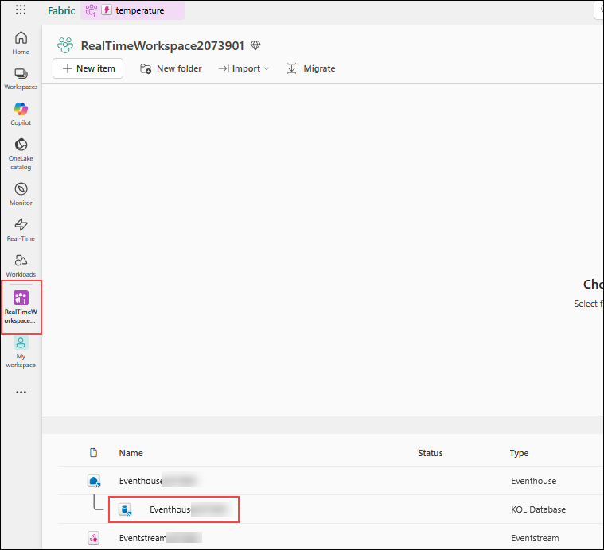

1.  Navigate to the Database tab and select **KQL Queryset** to begin creating your queries

    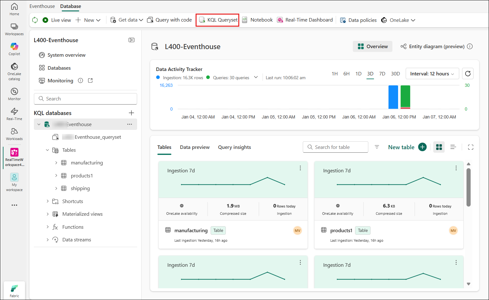

1.  In the **New KQL Queryset** dialog  box, enter **L400KQL_Queryset**, then click on the **Create** button.

    

    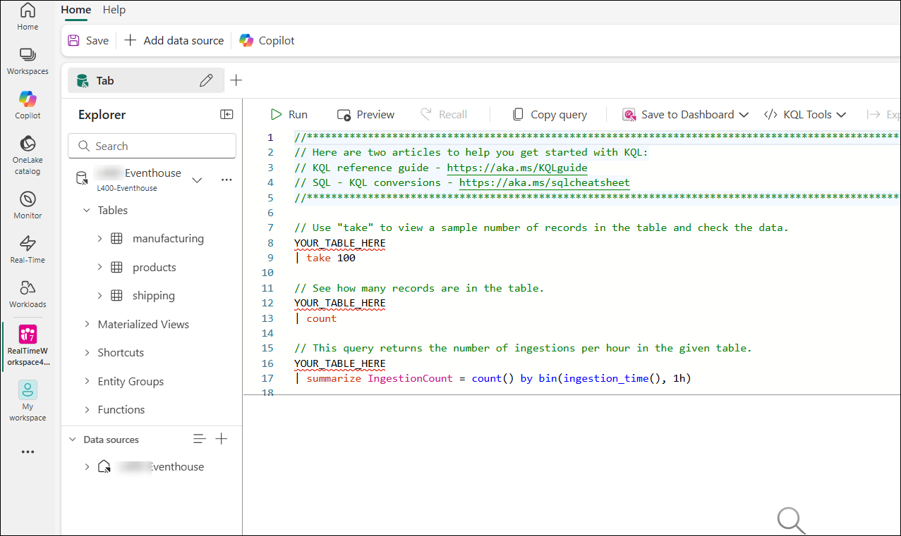

1.  In the query editor, replace the existing code by pasting the code provided below to create the Shipping Silver table, then click **Run** to execute the query. Once completed, the results will be displayed.
   
    ```
    .create table shipping_silver (
        Provider: string,
        OrderNumber: string,
        EventTime: datetime,
        Status: string,
        SourceCity: string,
        SourceCountry: string,
        SourceLatitude: real,
        SourceLongitude: real,
        DestinationName: string,
        DestinationStreet: string,
        DestinationCity: string,
        DestinationZip: string,
        DestinationCountry: string,
        DestinationLatitude: real,
        DestinationLongitude: real,
        WeightKg: real,
        ProductSize: string,
        ProductQuantity: int,
        ProductId: string
    )
    ```

       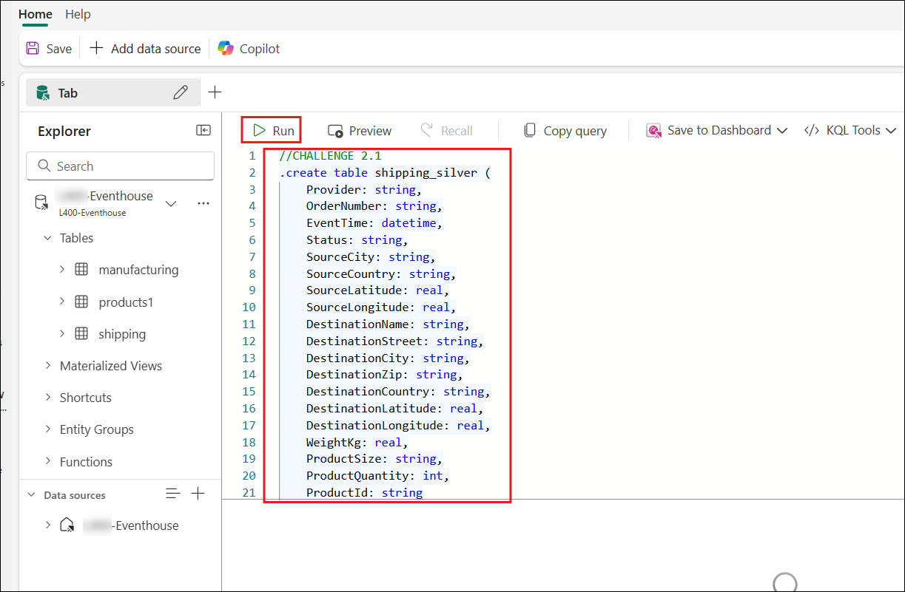
    
       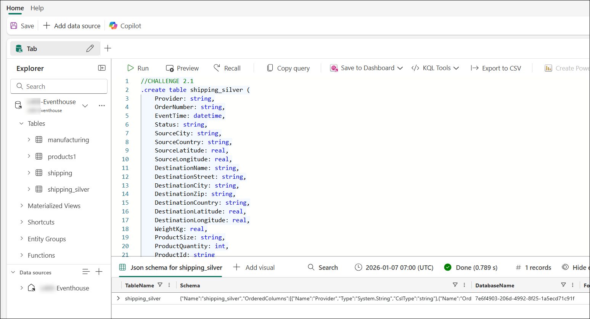

1.  Create a new tab within the queryset by clicking on the ***+* icon**

    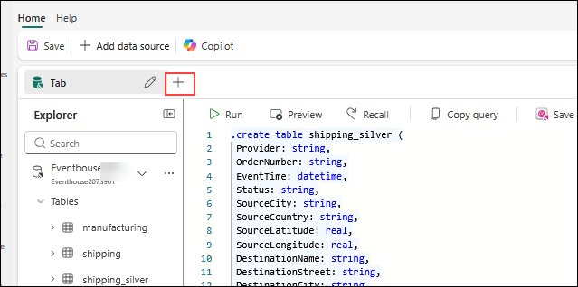

1.  In the query editor, paste the provided code to expand the XML and  project only the required fields, then click **Run** to execute the query. After execution, the results will be displayed
```
//Let`s expand the whole xml and project only the fields needed
shipping
| extend parsed = parse_xml(data)
| extend ShippingEvent = parsed.ShippingEvent
| extend Products = ShippingEvent.ShippingContents.Product
| extend
    Provider = tostring(ShippingEvent.Provider),
    OrderNumber = tostring(ShippingEvent.OrderNumber),
    EventTime = todatetime(ShippingEvent.EventTime),
    Status = tostring(ShippingEvent.Status),
    SourceCity = tostring(ShippingEvent.SourceDistributionCenter.City),
    SourceCountry = tostring(ShippingEvent.SourceDistributionCenter.Country),
    SourceLatitude = todouble(ShippingEvent.SourceDistributionCenter.Latitude),
    SourceLongitude = todouble(ShippingEvent.SourceDistributionCenter.Longitude),
    DestinationName = tostring(ShippingEvent.DestinationAddress.Name),
    DestinationStreet = tostring(ShippingEvent.DestinationAddress.Street),
    DestinationCity = tostring(ShippingEvent.DestinationAddress.City),
    DestinationZip = tostring(ShippingEvent.DestinationAddress.Zip),
    DestinationCountry = tostring(ShippingEvent.DestinationAddress.Country),
    DestinationLatitude = todouble(ShippingEvent.DestinationAddress.Latitude),
    DestinationLongitude = todouble(ShippingEvent.DestinationAddress.Longitude),
    Weight = todouble(ShippingEvent.WeightKg),
    ProductSize = tostring(Products.Size),
    ProductQuantity = toint(Products.Quantity),
    ProductId = tostring(Products.ProductId)
| project
    Provider,
    OrderNumber,
    EventTime,
    Status,
    SourceCity,
    SourceCountry,
    SourceLatitude,
    SourceLongitude,
    DestinationName,
    DestinationStreet,
    DestinationCity,
    DestinationZip,
    DestinationCountry,
    DestinationLatitude,
    DestinationLongitude,
    Weight,
    ProductSize,
    ProductQuantity,
    ProductId
```
   

   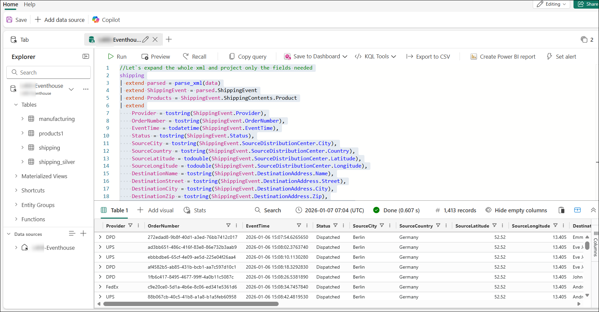

1.  Create a new tab within the queryset by clicking on the ***+* icon**

1.  In the query editor, paste the provided code to copy data from the shipping table to the shipping_silver table, then click **Run** to  execute the query. After execution, the results will be displayed.
```
.set-or-append shipping_silver <|
 shipping
    | extend parsed = parse_xml(data)
    | extend ShippingEvent = parsed.ShippingEvent
    | extend Products = ShippingEvent.ShippingContents.Product
    | project
        Provider = tostring(ShippingEvent.Provider),
        OrderNumber = tostring(ShippingEvent.OrderNumber),
        EventTime = todatetime(ShippingEvent.EventTime),
        Status = tostring(ShippingEvent.Status),
        SourceCity = tostring(ShippingEvent.SourceDistributionCenter.City),
        SourceCountry = tostring(ShippingEvent.SourceDistributionCenter.Country),
        SourceLatitude = todouble(ShippingEvent.SourceDistributionCenter.Latitude),
        SourceLongitude = todouble(ShippingEvent.SourceDistributionCenter.Longitude),
        DestinationName = tostring(ShippingEvent.DestinationAddress.Name),
        DestinationStreet = tostring(ShippingEvent.DestinationAddress.Street),
        DestinationCity = tostring(ShippingEvent.DestinationAddress.City),
        DestinationZip = tostring(ShippingEvent.DestinationAddress.Zip),
        DestinationCountry = tostring(ShippingEvent.DestinationAddress.Country),
        DestinationLatitude = todouble(ShippingEvent.DestinationAddress.Latitude),
        DestinationLongitude = todouble(ShippingEvent.DestinationAddress.Longitude),
        Weight = todouble(ShippingEvent.WeightKg),
        ProductSize = tostring(Products.Size),
        ProductQuantity = toint(Products.Quantity),
        ProductId = tostring(Products.ProductId)
```

   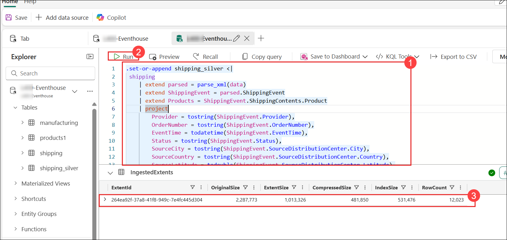

1.  Create a new tab within the queryset by clicking on the ***+* icon**.In the query editor, copy and paste the following code. Click on  the **Run** button to execute the query. After the query is executed, you will see the results.
```
shipping_silver
| take 100
```

  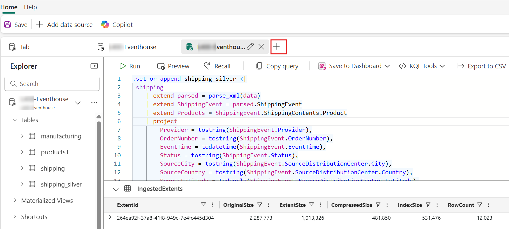
  
  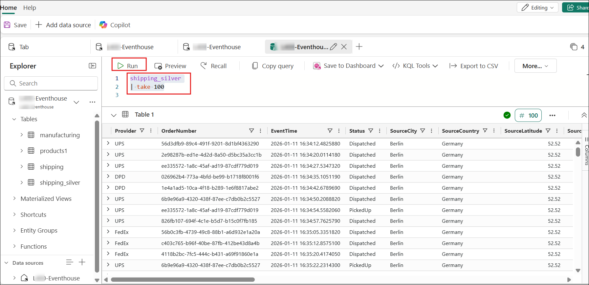

1.  Create a new tab within the queryset by clicking on the ***+* icon**

1. In the query editor, copy and paste the following code. Click on the **Run** button to execute the query. After the query is  executed, you will see the results.
```
//another way to do it is through a function 
.create-or-alter function with (folder = "UpdatePolicyFunctions", skipvalidation = "true") ParseShippingXML()
{
 shipping
    | extend parsed = parse_xml(data)
    | extend ShippingEvent = parsed.ShippingEvent
    | extend Products = ShippingEvent.ShippingContents.Product
    | project
        Provider = tostring(ShippingEvent.Provider),
        OrderNumber = tostring(ShippingEvent.OrderNumber),
        EventTime = todatetime(ShippingEvent.EventTime),
        Status = tostring(ShippingEvent.Status),
        SourceCity = tostring(ShippingEvent.SourceDistributionCenter.City),
        SourceCountry = tostring(ShippingEvent.SourceDistributionCenter.Country),
        SourceLatitude = todouble(ShippingEvent.SourceDistributionCenter.Latitude),
        SourceLongitude = todouble(ShippingEvent.SourceDistributionCenter.Longitude),
        DestinationName = tostring(ShippingEvent.DestinationAddress.Name),
        DestinationStreet = tostring(ShippingEvent.DestinationAddress.Street),
        DestinationCity = tostring(ShippingEvent.DestinationAddress.City),
        DestinationZip = tostring(ShippingEvent.DestinationAddress.Zip),
        DestinationCountry = tostring(ShippingEvent.DestinationAddress.Country),
        DestinationLatitude = todouble(ShippingEvent.DestinationAddress.Latitude),
        DestinationLongitude = todouble(ShippingEvent.DestinationAddress.Longitude),
        Weight = todouble(ShippingEvent.WeightKg),
        ProductSize = tostring(Products.Size),
        ProductQuantity = toint(Products.Quantity),
        ProductId = tostring(Products.ProductId)
}
```
  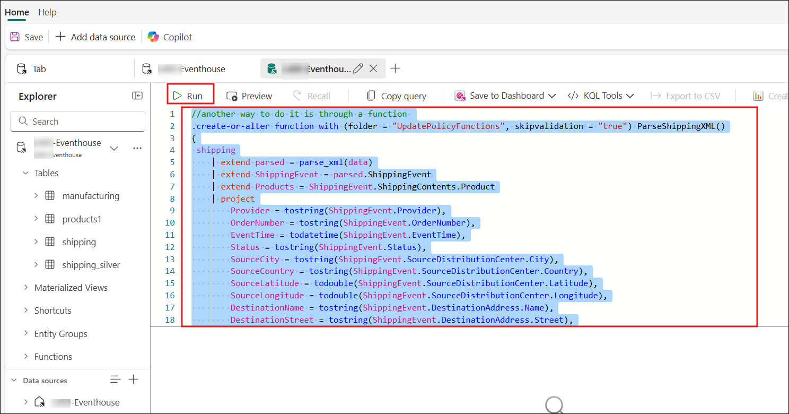

  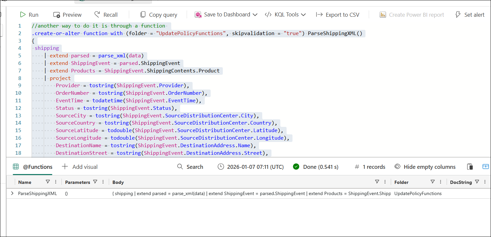

1. Create a new tab within the queryset by clicking on the ***+* icon**

   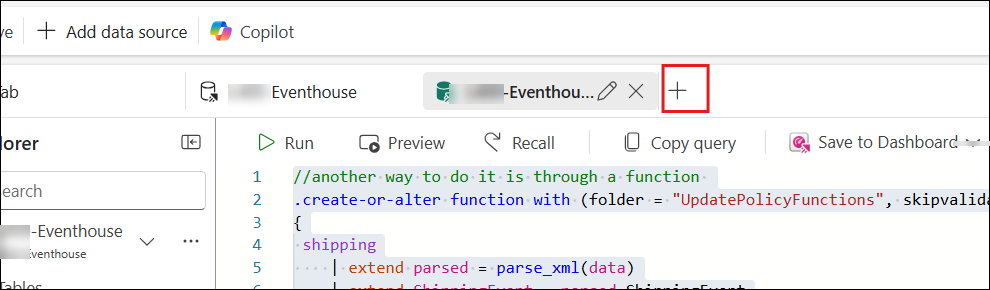

1. In the query editor, copy and paste the following code. Click on  the **Run** button to execute the query. After the query is executed, you will see the results.
```
.alter table shipping_silver policy update
@'[{  "IsEnabled": true, "Source": "shipping", "Query": "ParseShippingXML()",  "IsTransactional": false, "PropagateIngestionProperties": false }]'
```

   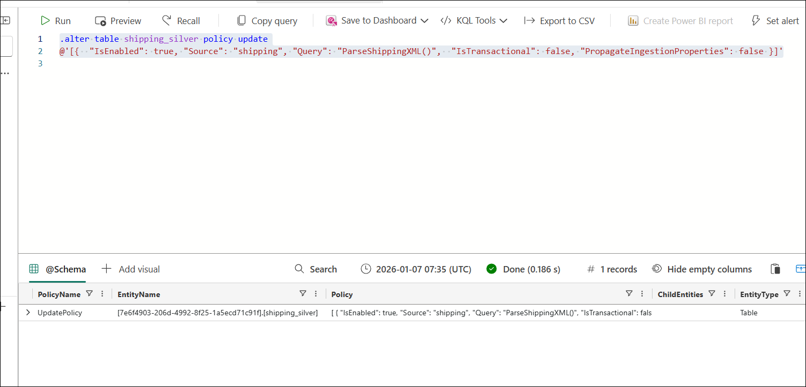

13. Create a new tab within the queryset by clicking on the ***+* icon**

    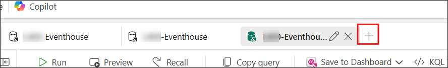

1. In the query editor, paste the provided code to **verify that your function is working**, then click **Run** to execute the query. After execution, the results will be displayed.
```
//Verify your function is working
ParseShippingXML()
| take 1000
```

  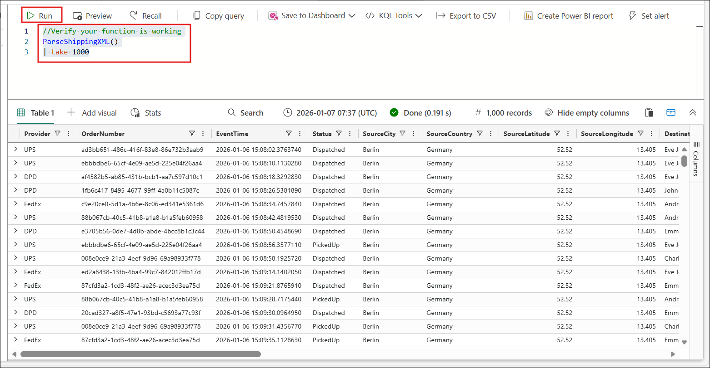

1. Create a new tab within the queryset by clicking on the ***+* icon**

1. In the query editor, paste the provided code to **verify policy  exists**, then click **Run** to execute the query. After execution, the results will be displayed.
```
//Verify policy exists
.show table shipping_silver policy update
```
  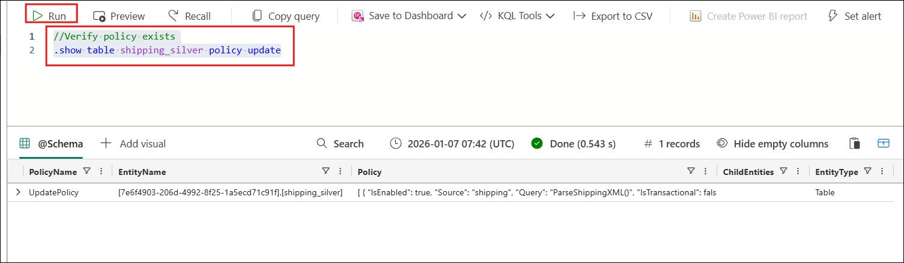

1. Create a new tab within the queryset by clicking on the ***+* icon**

1. In the query editor, paste the provided code to verify that data is available. If no data is found, rerun the notebook and redo the continuous ingestion for Blob. Then click **Run** to execute the query. After execution, the results will be displayed
   
```
//Verify you have data, if not rerun the notebok, and redo the continous ingestion for Blob
shipping_silver
| take 10000
```
  

1. Create a new tab within the queryset by clicking on the ***+* icon**

1. In the query editor, paste the provided code to **get latest shipping details**, then click **Run** to execute the query. After execution, the results will be displayed.
   
```
//get latest shipping details 
 .create materialized-view with (backfill=true) LatestOrderStatus on table shipping_silver
{
    shipping_silver
    | summarize arg_max(EventTime, *) by OrderNumber
}
```
  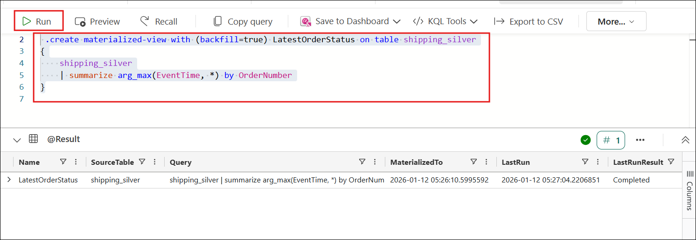

## Task 2: Stop the shipping providers and production line that is carrying the highest defect probability product for every 1 hour

1.  Create a new tab within the queryset by clicking on the ***+* icon**

1.  In the query editor, copy and paste the following code. Click on  the **Run** button to execute the query. After the query is  executed, you will see the results.
   
    ```
    //click on jPath instead of inline when on payload, click on ProdId * copy path
    products
    | extend Operator = payload.op
    | where  Operator == ("c") 
    | extend ProductId = ['payload']['after']['ProductId']
    | extend ProductName = payload.after.ProductName
    | extend SKU = payload.after.SKU
    | extend Brand = payload.after.Brand
    | extend Category = payload.after.Category
    | extend UnitCost = payload.after.UnitCost
    ```

    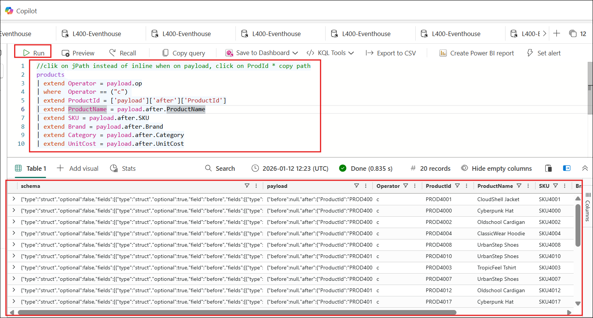

1.  Create a new tab within the queryset by clicking on the ***+* icon**

1.  In the query editor, paste the provided code to create **products
    silver** table, then click **Run** to execute the query. After
    execution, the results will be displayed
    
    ```
    .create table products_silver (
        ProductId: string,
        ProductName: string,
        SKU: string,
        Brand: string,
        Category: string,
        UnitCost: int
    )
    ```
     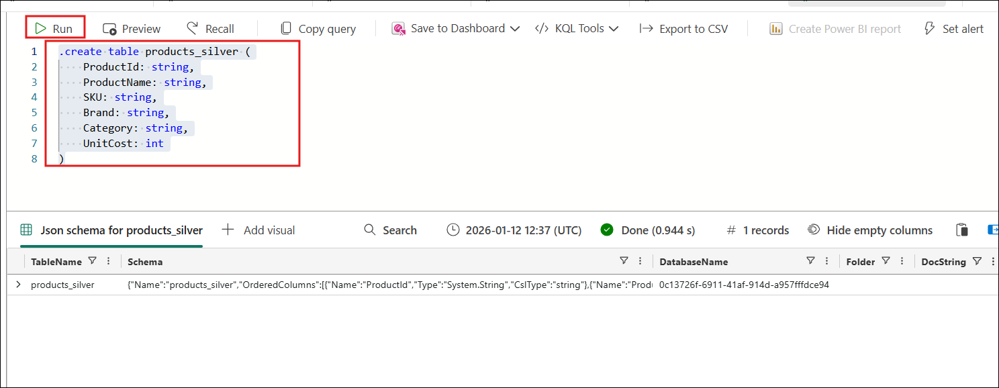

1.  Create a new tab within the queryset by clicking on the ***+* icon**

1.  In the query editor, copy and paste the following code. Click on
    the **Run** button to execute the query. After the query is
    executed, you will see the results.
    
    ```
    .set-or-append products_silver <|
    products
    | extend Operator = payload.op
    | where  Operator == ("c") 
    | extend ProductId = tostring(['payload']['after']['ProductId'])
    | extend ProductName = tostring(payload.after.ProductName)
    | extend SKU = tostring(payload.after.SKU)
    | extend Brand = tostring(payload.after.Brand)
    | extend Category = tostring(payload.after.Category)
    | extend UnitCost = toint(payload.after.UnitCost)
    | project ProductId, ProductName, SKU, Brand, Category, UnitCost
    ```

    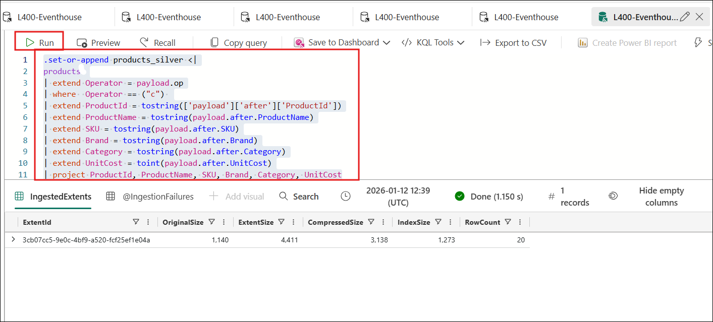

1.  Click on the icon **RealTimeWorkspace<inject key="DeploymentID" enableCopy="false" />** in the left toolbar and select **Eventhouse<inject key="DeploymentID" enableCopy="false" />**

    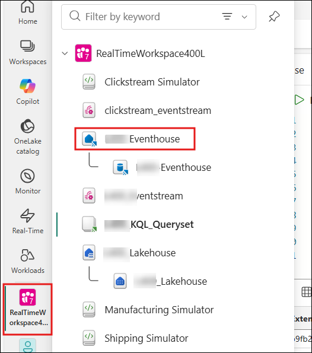

1.  Select **Eventhouse<inject key="DeploymentID" enableCopy="false" />** KQL Database

    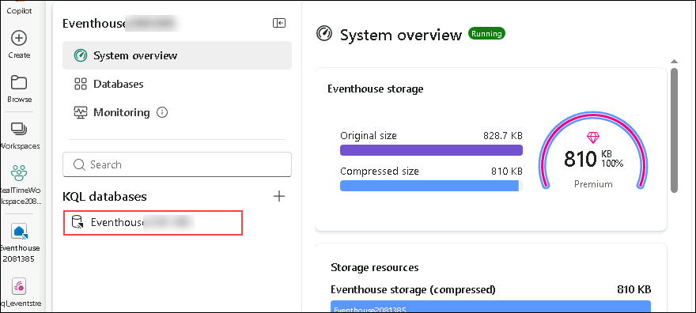

1.  Click on the button **Get data** in the menu bar at the top.Choose **Local file** from the dropdown menu.

    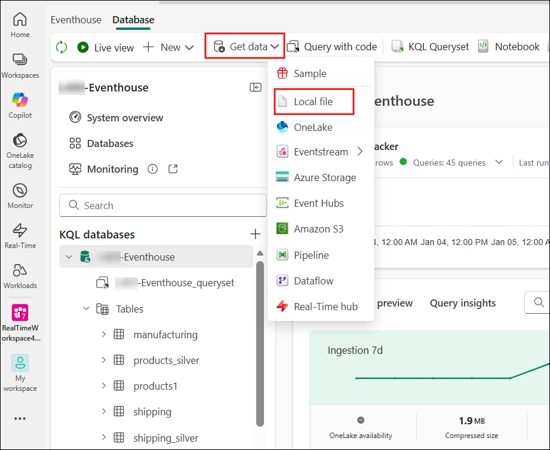

1. Select the **+ New table**

    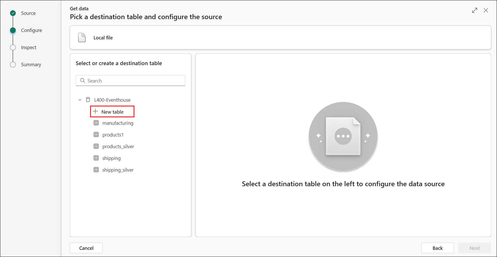

1. Enter the new table name as **shipping_provider** and click on the checkmark.Click on Browse for file

    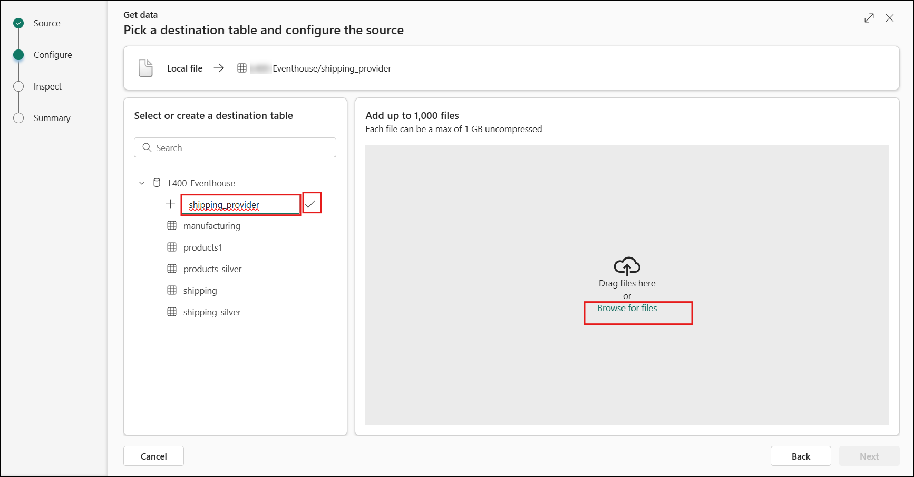

1. Navigate and select **Shipping \_Provider_Details** notebooks from **C:\LabFiles**and click the **Open** button.

    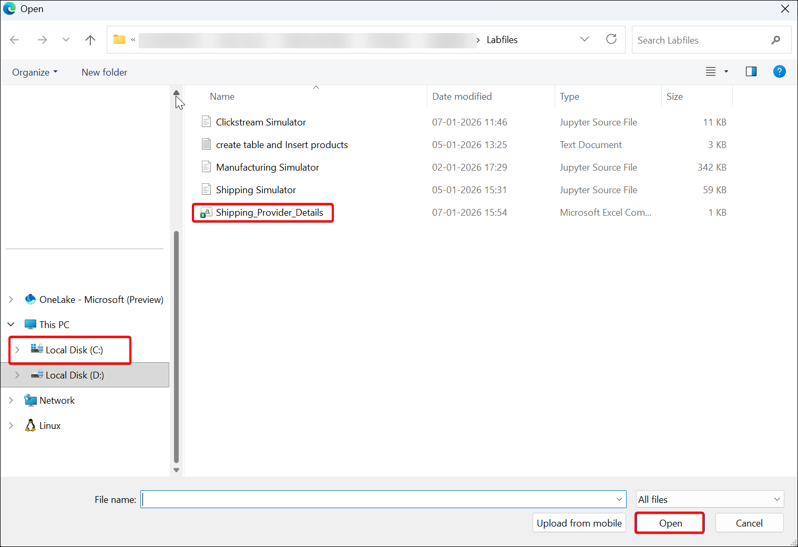

1. Select **Next**

    

1. Click on **Finish** button

    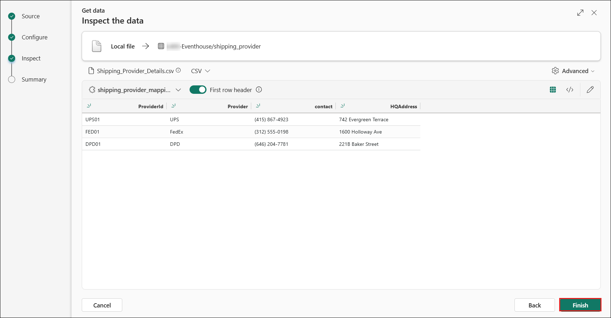

1. Click on **Close** button

    

    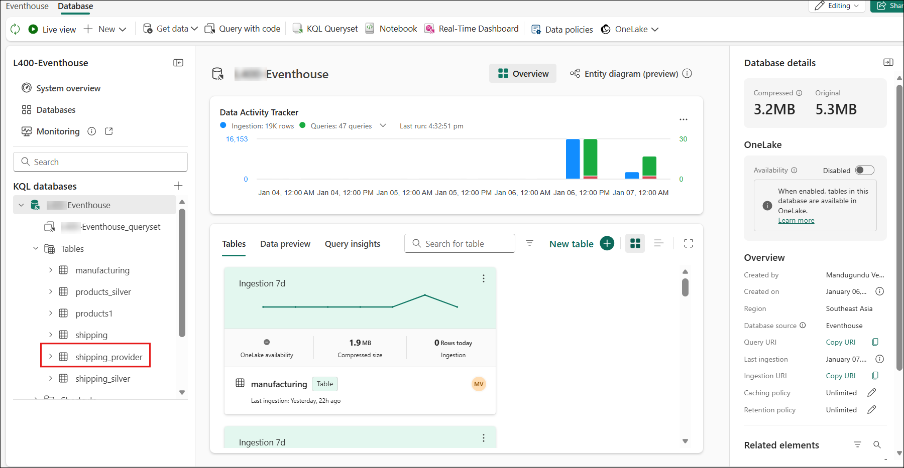

1. Click on the icon **RealTimeWorkspace<inject key="DeploymentID" enableCopy="false" />** in the left toolbar and select **L400_KQL_Queryset**

    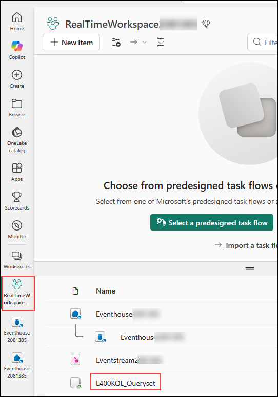

1. Create a new tab within the queryset by clicking on the ***+* icon**

1. In the query editor, paste the provided code to stop shipping from production when a defect is detected, then click **Run** to execute the query. After execution, the results will be displayed.
    
    ```
    //stop shipping from production with a defect
    manufacturing
    | where ingestion_time()> ago(24h)
    | top 1 by DefectProbability desc 
    | join kind=inner external_table('operators') on OperatorId
    | join (shipping_silver | where Status == "Dispatched") on ProductId
    | join (shipping_provider | project Provider = trim(" ", Provider), contact, HQAddress) on Provider
    | join products_silver on ProductId
    | project OrderNumber, ProductName,  ShippingProvider = Provider1 , ProviderNUmber =contact , HQAddress
    ```

     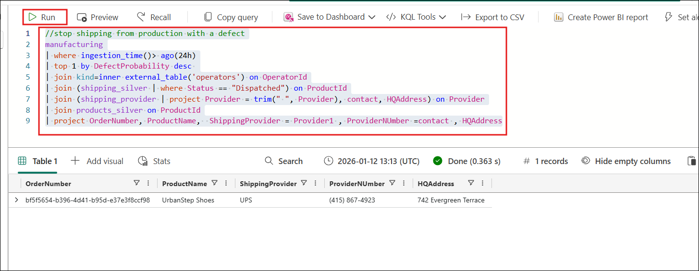

1. Create a new tab within the queryset by clicking on the ***+* icon**

1. In the query editor, paste the provided code to stop operator from  production with a defect, then click **Run** to execute the query. After execution, the results will be displayed
   
    ```
    //stop operator from production with a defect
    manufacturing
    | where ingestion_time()> ago(24h)
    | top 1 by DefectProbability desc 
    | join kind=inner external_table('operators') on OperatorId
    | join (shipping_silver | where Status == "Dispatched") on ProductId
    | join (shipping_provider | project Provider = trim(" ", Provider)) on Provider
    | join products_silver on ProductId
    | extend OperatorDetails = strcat(OperatorId, "-" ,OperatorName)
    | extend ProductDetails = strcat(ProductId, "-" ,ProductName)
    | project OperatorDetails, ProductDetails, Phone, AssetId, BatchId
    ```

    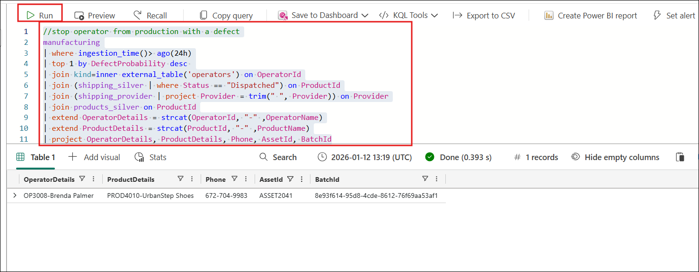

## Task 3: Create an Alert to Stop the Production Line with Detailed Product and Operator Information

1.  Create a new tab within the queryset by clicking on the ***+* icon**

1.  In the query editor, paste the provided code to show all operators details, then click **Run** to execute the query. After execution,the results will be displayed.
   
    ```
    //Show all operators details
    external_table('operators')
    | project Name, Phone, Email, Role, Shift
    ```
  
    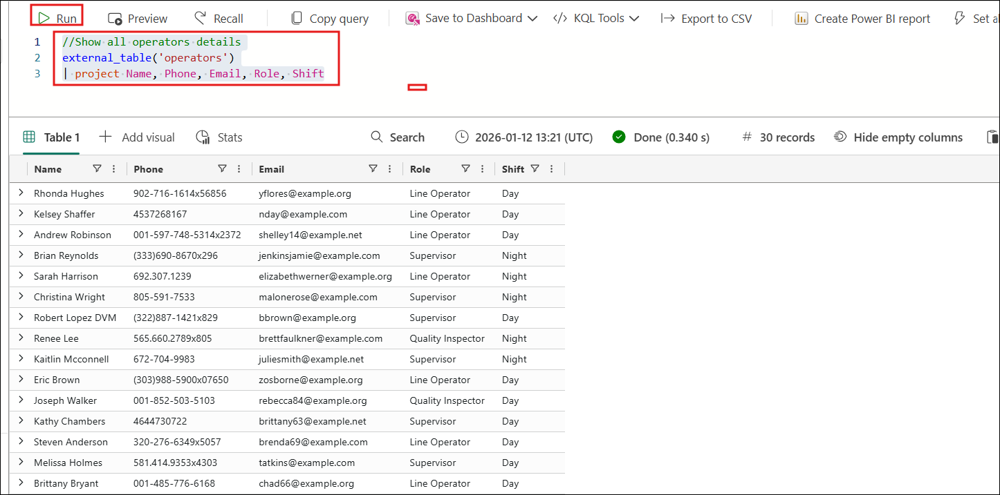

1.  Create a new tab within the queryset by clicking on the ***+* icon**

1.  In the query editor, paste the provided code to Current Defective Item Detail, then click **Run** to execute the query. After execution, the results will be displayed.
   
    ```
    // Current Defective Item Detail
    manufacturing
    | where ingestion_time()> ago(24h)
    | top 1 by DefectProbability desc 
    | join kind=inner external_table('operators') on OperatorId
    | join (shipping_silver | where Status == "Dispatched") on ProductId
    | join (shipping_provider | project Provider = trim(" ", Provider), contact, HQAddress) on Provider
    | join products_silver on ProductId
    | project OrderNumber, ProductName,  ShippingProvider = Provider1 , ProviderNUmber =contact , HQAddress, OperatorName, DefectProbability
    ```

    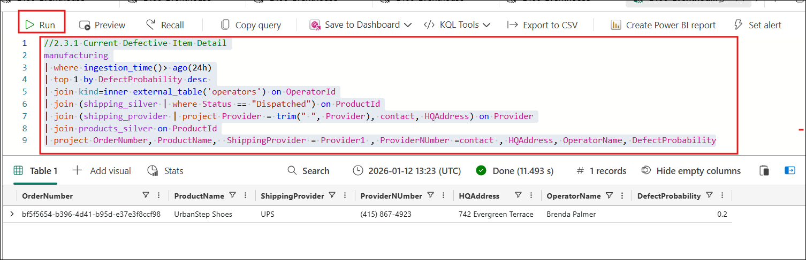

1.  Create a new tab within the queryset by clicking on the ***+* icon**

1.  In the query editor, paste the provided code to correlation between defective and non-defective products in 1 hour bins, then click **Run** to execute the query. After execution, the results will be displayed.
   
    ```
    // Correlation between defective and non-defective products in 1 hour bins
    manufacturing
    | summarize count() by bin(todatetime(timestamp), 1h), DefectProbability
    ```

    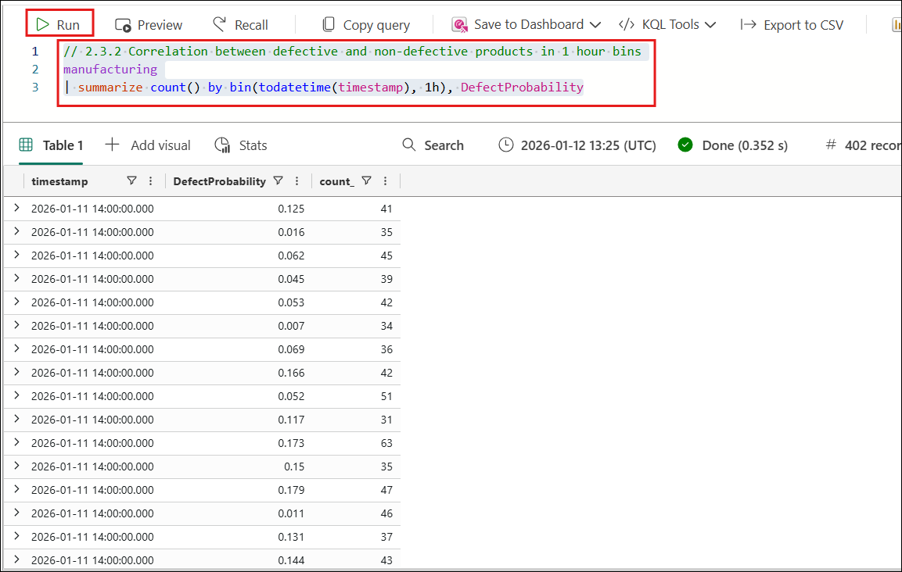

7.  Create a new tab within the queryset by clicking on the ***+* icon**

8.  In the query editor, paste the provided code to Current shipment status (count of orders by status), then click **Run** to execute the query. After execution, the results will be displayed.
   
    ```
    // Current shipment status (count of orders by status).
    shipping_silver
    | summarize countOfOrders=count() by Status
    | project Status, NumberofOrders = countOfOrders
    | order by NumberofOrders
    ```
    
    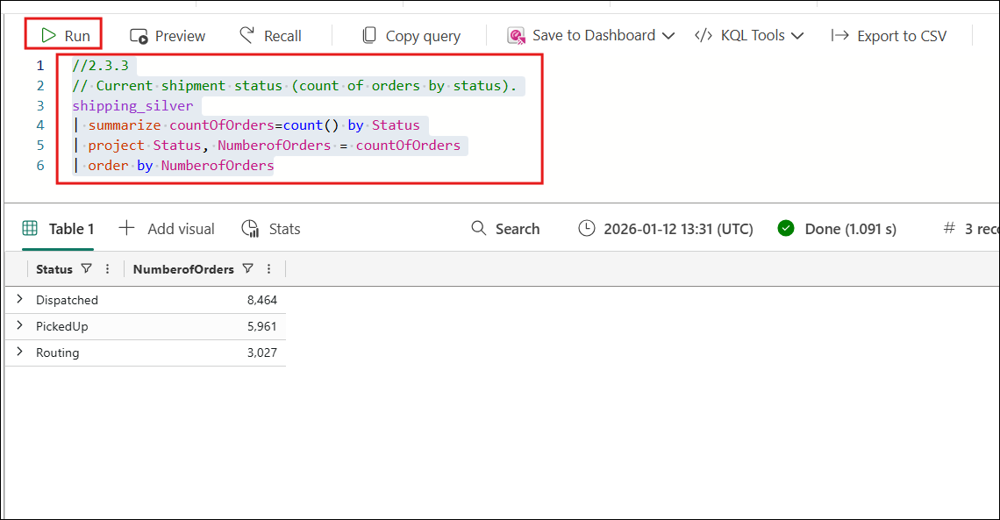

9.  Create a new tab within the queryset by clicking on the ***+* icon**

10. In the query editor, paste the provided code to shipment count by destination, then click **Run** to execute the query. After execution, the results will be displayed.

    ```
    // shipment count by destination
    shipping_silver
    | summarize shipmentCount=count() by DestinationCountry, DestinationCity, DestinationLatitude, DestinationLongitude
    | project DestinationCountry, DestinationCity, DestinationLatitude, DestinationLongitude, shipmentCount
    ```

     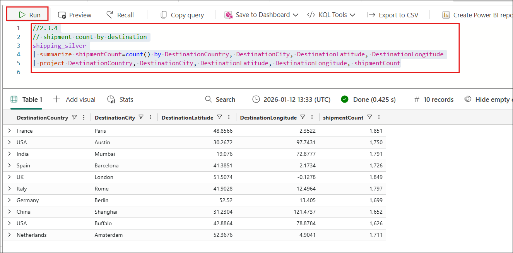

## Task 4: Create an operational dashboard for Fabrikam management

1.  Click on the icon **RealTimeWorkspace<inject key="DeploymentID" enableCopy="false" />** in the left toolbar.

1.  In the Workspaces pane, select **+ New item**. In the **Filter by item type** search box, enter **Real-Time Dashboard** and select the **Real-Time-Dashboard** item.

    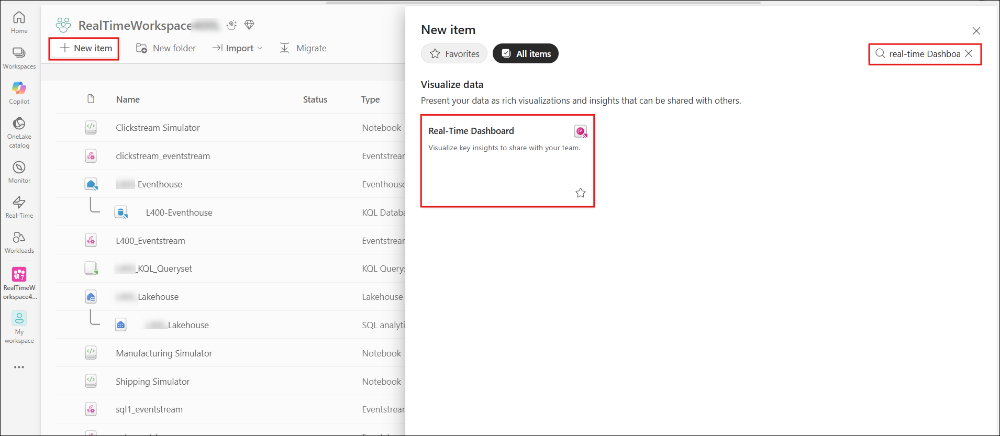

1.  Enter **RTDashboard<inject key="DeploymentID" enableCopy="false" />** as the eventstream name and select **Create**. 

    

1.  Select **Eventhouse<inject key="DeploymentID" enableCopy="false" />** KQL Database and click on **Add Tile**

    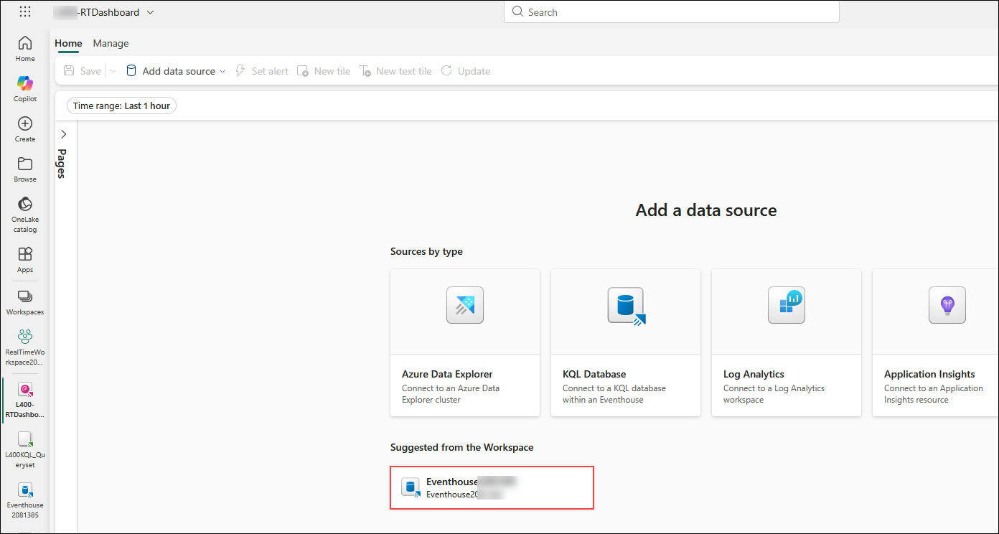

    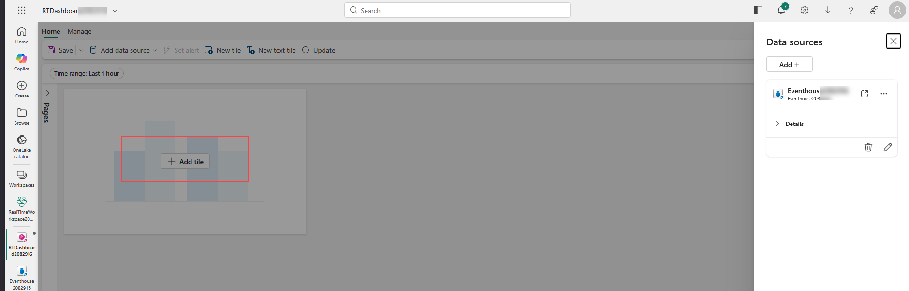

    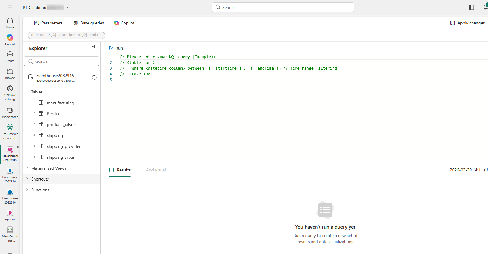

1.  In the Query editor, select **Copilot** from the top menu and use it to generate KQL query

    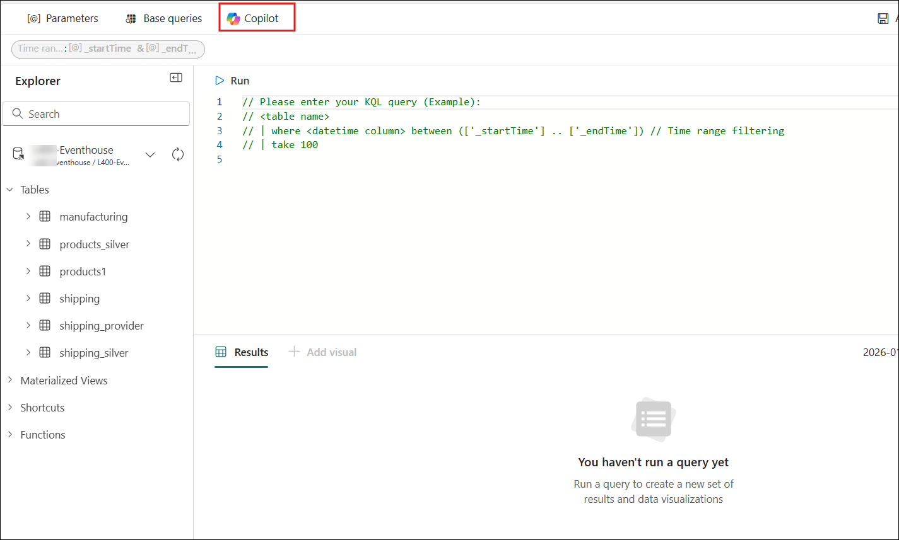

1.  Enter the following text and click on the **Submit icon** as shown
    in the below image.
    
    ```
    Create a real-time dashboard table that shows all operators handling shipments in the last 24 hour.
    Include operator name, phone number, provider, total shipments handled, defective shipment count, and average defect probability.
    Sort by total shipments in descending order and refresh automatically.
    ```

    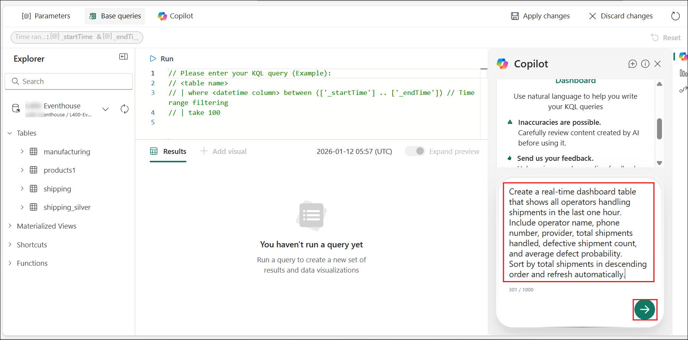

1.  Select the **Replace** option to update the existing content as required.

    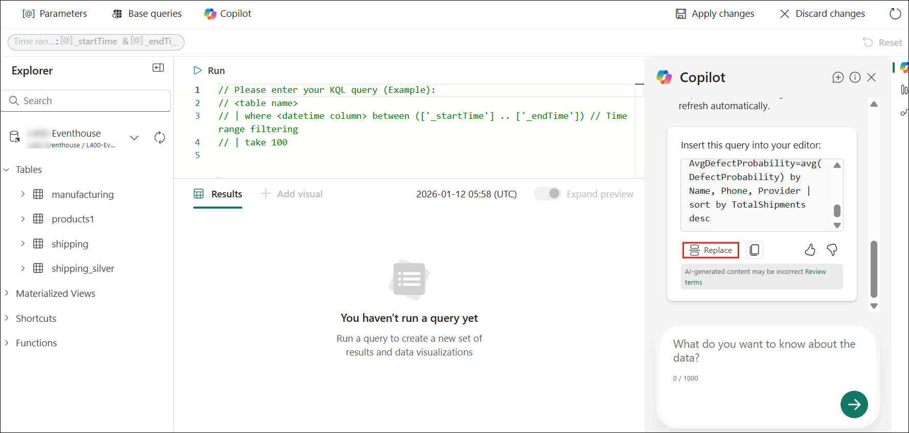

1.  Click **Run** to execute the query.

    

       >**Note:** If you face any error with the AI generated code.Kindly run the below code in the query editor
  
       ```
        // This KQL query was generated by AI:
        
        // Create a real-time dashboard table that shows all operators handling
        shipments in the last 24 hour.
        
        //Include operator name, phone number, provider, total shipments
        handled, defective shipment count, and average defect probability.
        
        //Sort by total shipments in descending order and refresh automatically.
        
        //
        
        manufacturing
        
        | where ingestion_time() \> ago(24h)
        
        | join kind=inner (shipping_silver | where Status == "Dispatched") on
        ProductId
        
        | join kind=inner (shipping_provider | project Provider = trim(" ",
        Provider), contact) on Provider
        
        | summarize
        
            TotalShipments=count() ,
        
            DefectiveShipments=countif(DefectProbability \> 0),
        
            AvgDefectProbability=avg(DefectProbability)
        
            by OperatorName, contact, Provider
        
        | sort by TotalShipments desc
        
        | project OperatorName, PhoneNumber=contact, Provider, TotalShipments,
        DefectiveShipments, AvgDefectProbability
     
       ```

1.  Click on the **+Add visual**

    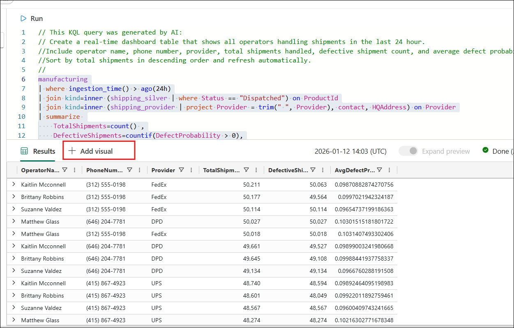

1. In the **Visual formatting** tab, set Tile name to **shipments in the last 24 hour**, set Visual type to **Table.** Click on **Apply changes**.

   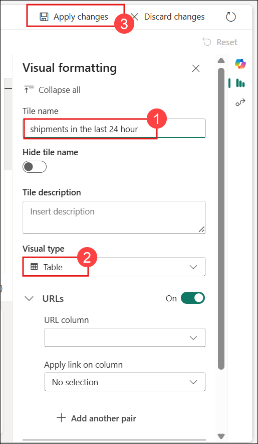

   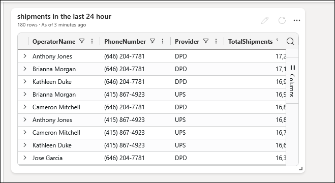

1. While editing the dashboard, click on the tab **Manage** on the top left then click on the button **Parameters**.

   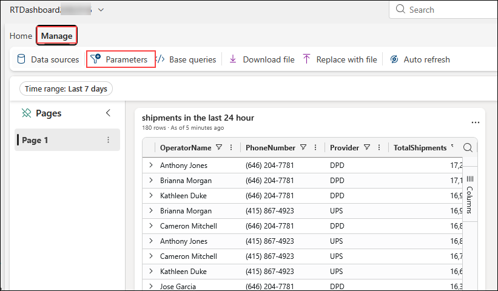

1. To edit the parameter **Time range** click on the pencil icon. This will enter the edit mode for this parameter.

   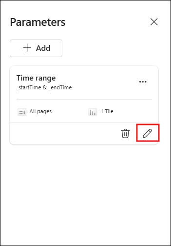

1. Select **Last 7 Days** in the combo box **Default value**. Then click on **Done**.

   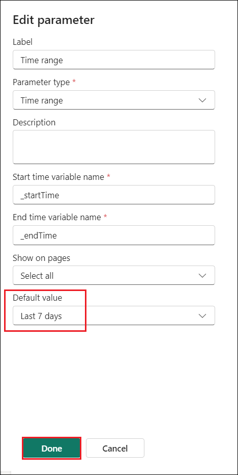

1. In the parameter pane click on the button **Close**.

1. Click on the tab **Home** and then click on the button **New tile** again to proceed with the next visuals.

   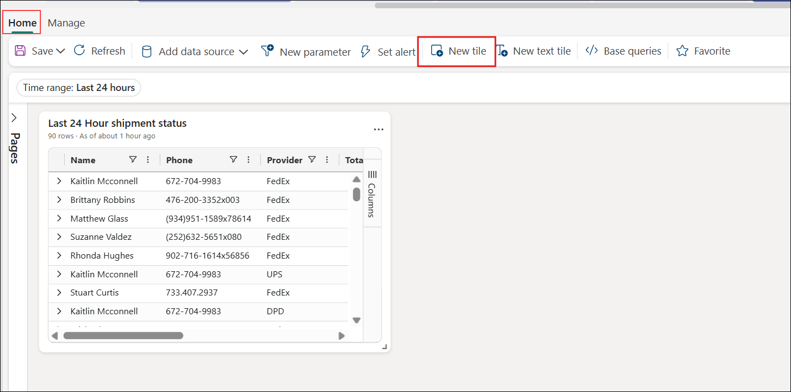

1. In the query editor, **paste** the following code.
    ```
    shipping_silver
    | where Status  in ("Dispatched", "PickedUp", "Routing")
    | where EventTime > ago(1h)
    | summarize countByStatus=count() by Status
    ```

1. Click on **Run** to execute the query.Select **+Add visual**

    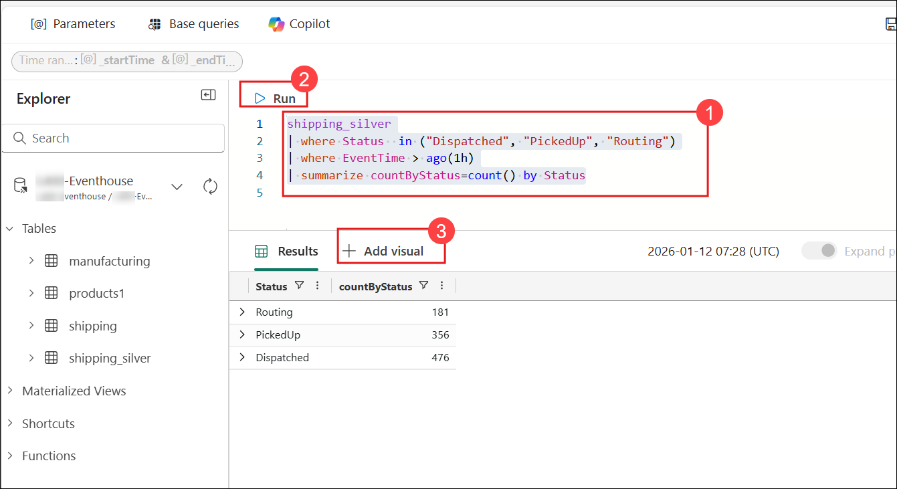

1. In the **Visual formatting** tab, set Tile name to **Last One Hour Shippment status**, set Visual type to **Multi stat.**. Change the Display Orientation to **Vertical** and Text size to **Small**

    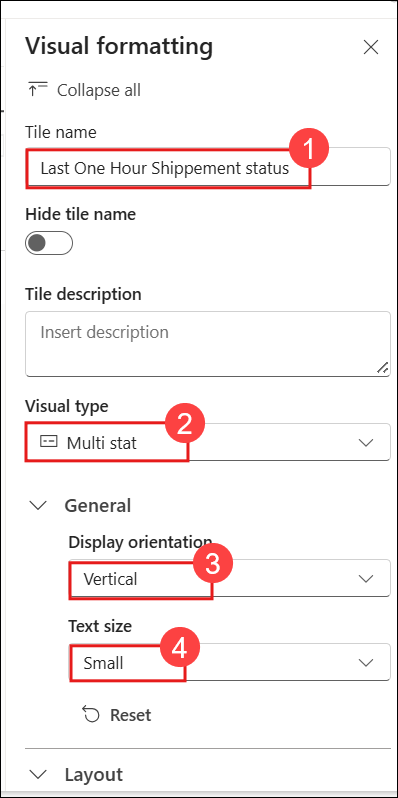

1. Change the Layout configuration to **1 column x 3 rows**.Click on the **Apply changes**
   
    

    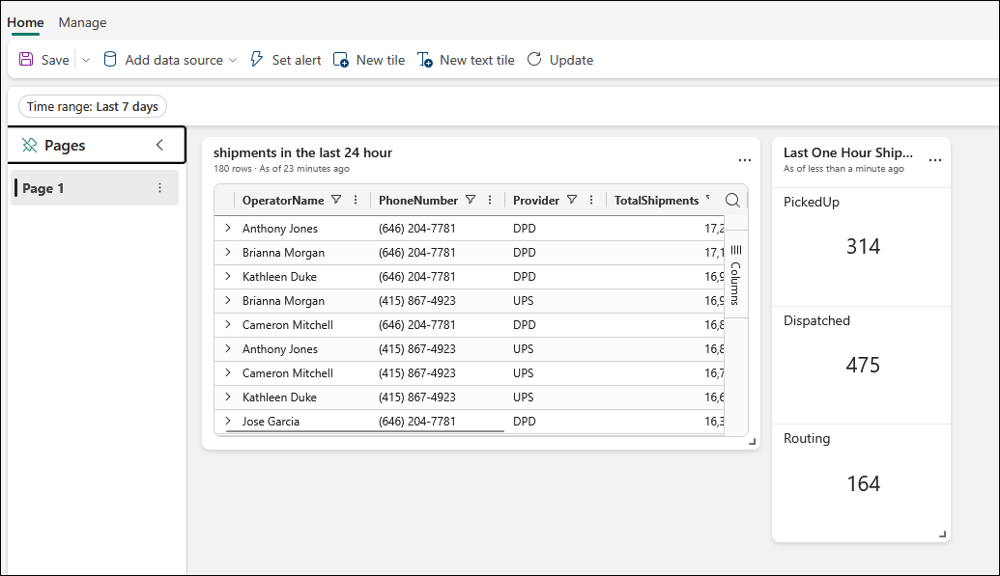

1. While editing the dashboard, click **Home** on the top left, and select **New title** to proceed with the next visuals.

    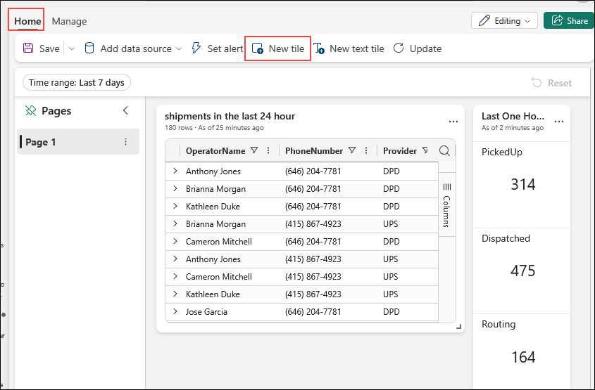

1. In the query editor, **paste** the following code, then click  on **Run** to execute the query. Select **+Add visual**
   
    ```
    // manufacturing
    //| where DefectProbability >= 0.2
    //| summarize arg_max(EventProcessedUtcTime, *)
    //| project
    //    Provider,
    //    ProductName,
    //    OrderNumber,
    //    OperatorName,
    //    Phone,
    //    max_DefectProbability = DefectProbability
    //
    manufacturing
    | where DefectProbability >= 0.2
    | summarize arg_max(EventProcessedUtcTime, *) 
    | join kind=leftouter (operators | project OperatorId, OperatorName=Name, Phone) on OperatorId
    | join kind=leftouter (products | project ProductId, ProductName) on ProductId
    | project
        Provider = "",
        ProductName,
        OrderNumber = "",
        OperatorName,
        Phone,
        max_DefectProbability = DefectProbability
    ```

     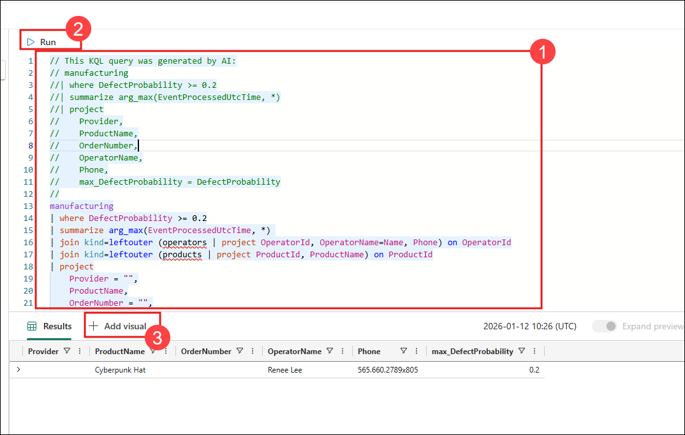

1. In the **Visual formatting** tab, set Tile name to **Current defective item details**, set Visual type to **Table.** Click on the **Apply changes**.

     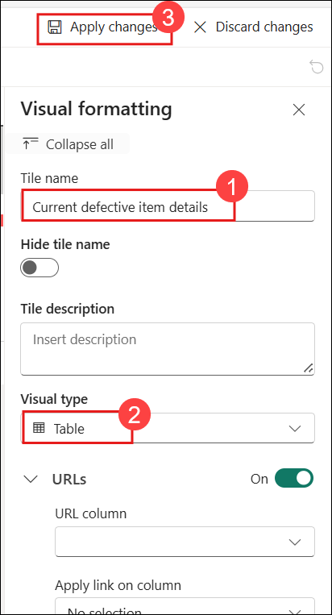

1. While editing the dashboard, click **Home** on the top left, and  select **New title** to proceed with the next visuals.

     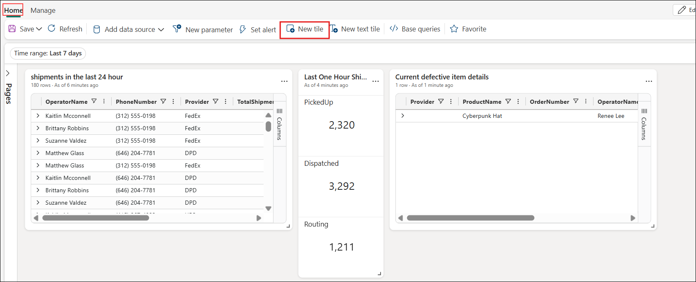

1. In the query editor, **paste** the following code, then click  on **Run** to execute the query.Select **+Add visual**

    ```
    shipping
    | extend xmlData = parse_xml(data)
    | project
        country = tostring(['xmlData']['ShippingEvent']['DestinationAddress']['Country']),
        city = tostring(['xmlData']['ShippingEvent']['DestinationAddress']['City'])
    | summarize countCountry=count() by country, city
    | lookup sites on $left.country == $right.Country and $left.city == $right.City
    | project country, city, Longitude, Latitude, countCountry
    | where isnotnull(Longitude) and isnotnull(Latitude)
    | render scatterchart with (kind = map, xcolumn = Longitude, ycolumns = Latitude, series = country, title = "Delivery Country by Destination")
    ```  

    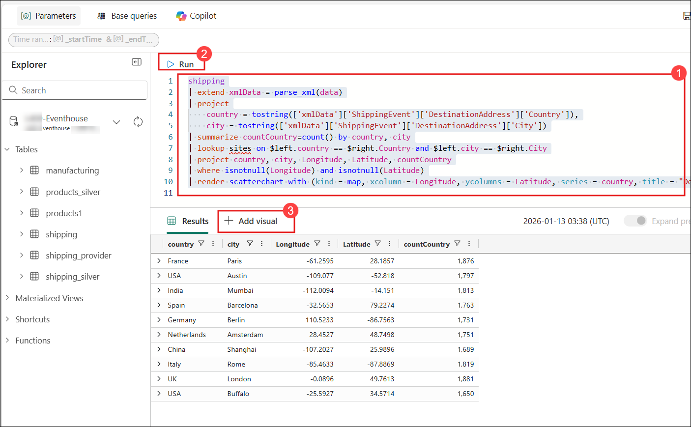

1. In the **Visual formatting** tab, set Tile name to **Delivery Country by Destination**, set Visual type to **Map.** Under Data in the **Define location by** select **Latitude and longitude**. Finally, Click on **Apply changes**.

   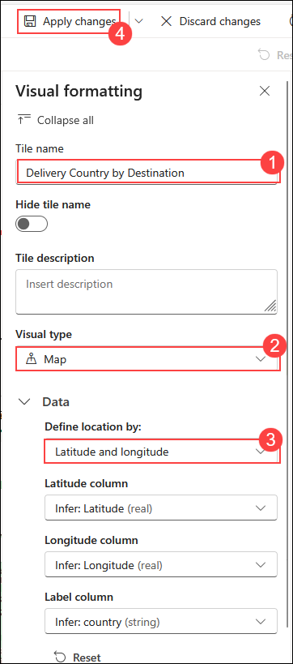

   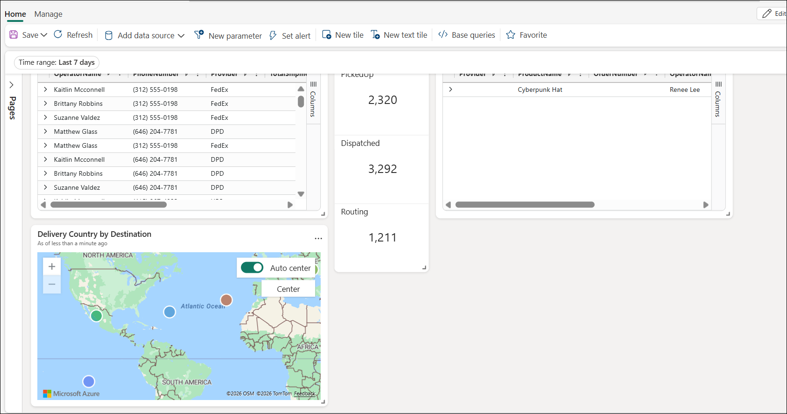

1. While editing the dashboard, click **Home** on the top left, and select **New title** to proceed with the next visuals.

   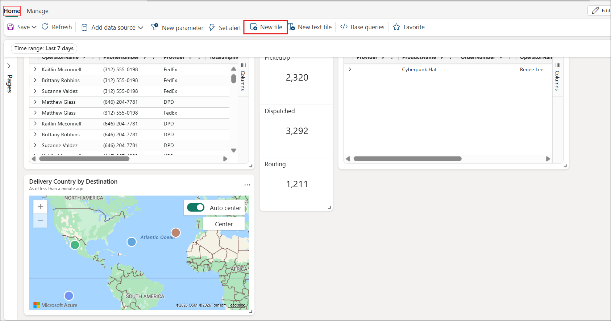

1. In the query editor, **paste** the following code, then click on **Run** to execute the query. Select **+Add visual**
   
    ```
    // Correlation between defective and non-defective products in 1 hour bins
    //Hint: Use the anomaly flag column you defined in the SQL Code Operator before, to see the defection & non-defective products and use that in a line chart
    manufacturing
    | extend Defective = iff(Anamoly == "1", 1, 0), NonDefective = iff(Anamoly == "0", 1, 0)
    | summarize DefectiveCount=sum(Defective), NonDefectiveCount=sum(NonDefective) by bin(EventProcessedUtcTime, 1h)
    | project EventProcessedUtcTime, DefectiveCount, NonDefectiveCount
    | render linechart 
        with (
            title="Defective vs Non-Defective Products (1h bins)",
            xtitle="Time (1h bins)",
            ytitle="Count"
        )
    ```

      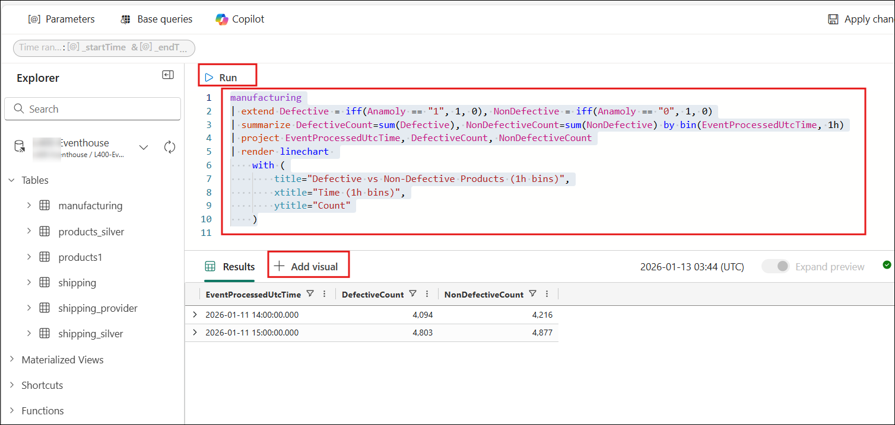

1. In the **Visual formatting** tab, set Tile name to **Defective and Proper production**, set Visual type to **Line chart.** Click on the **Apply changes**.

     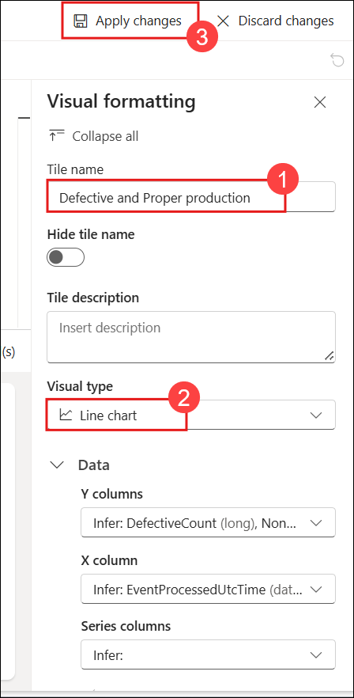

     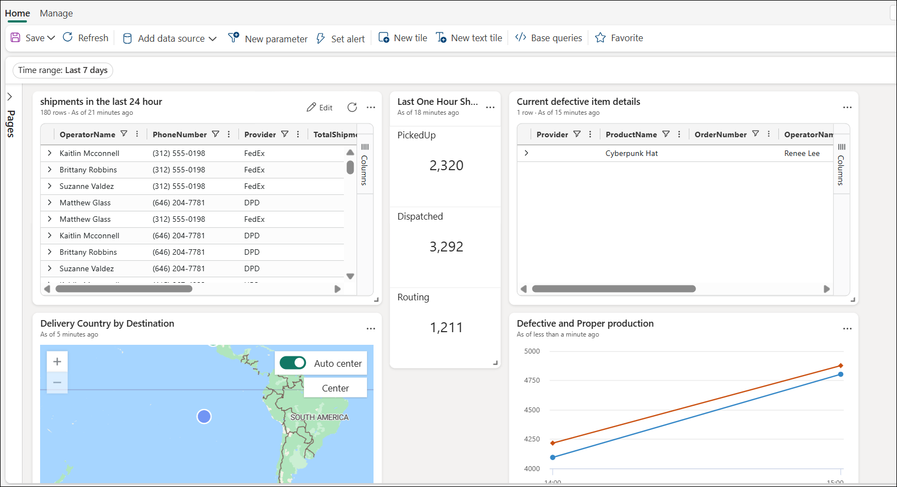

1. While editing the dashboard, click on the tab **Manage** and then click on the button **Auto refresh**. This will open a pane on the right side of the browser.

    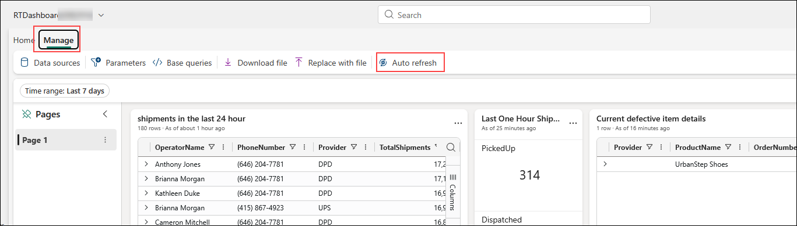

1. In the pane **Auto refresh** set it to **Enabled** and set **Default refresh rate** to **Continous**. Then click on the button **Apply**

    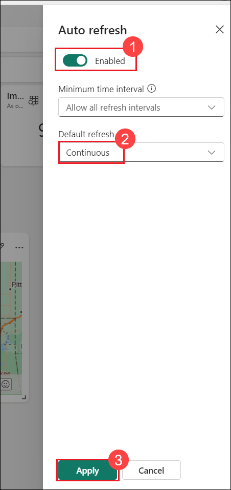

1. Click on the tab **Home** and then click on the button **Save**.

   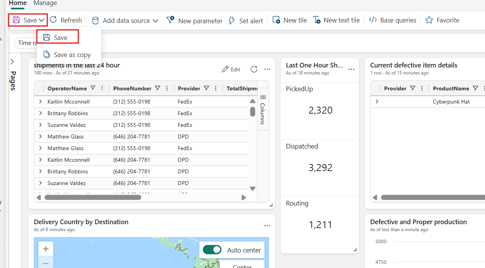


